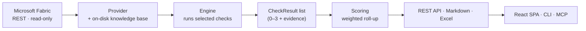
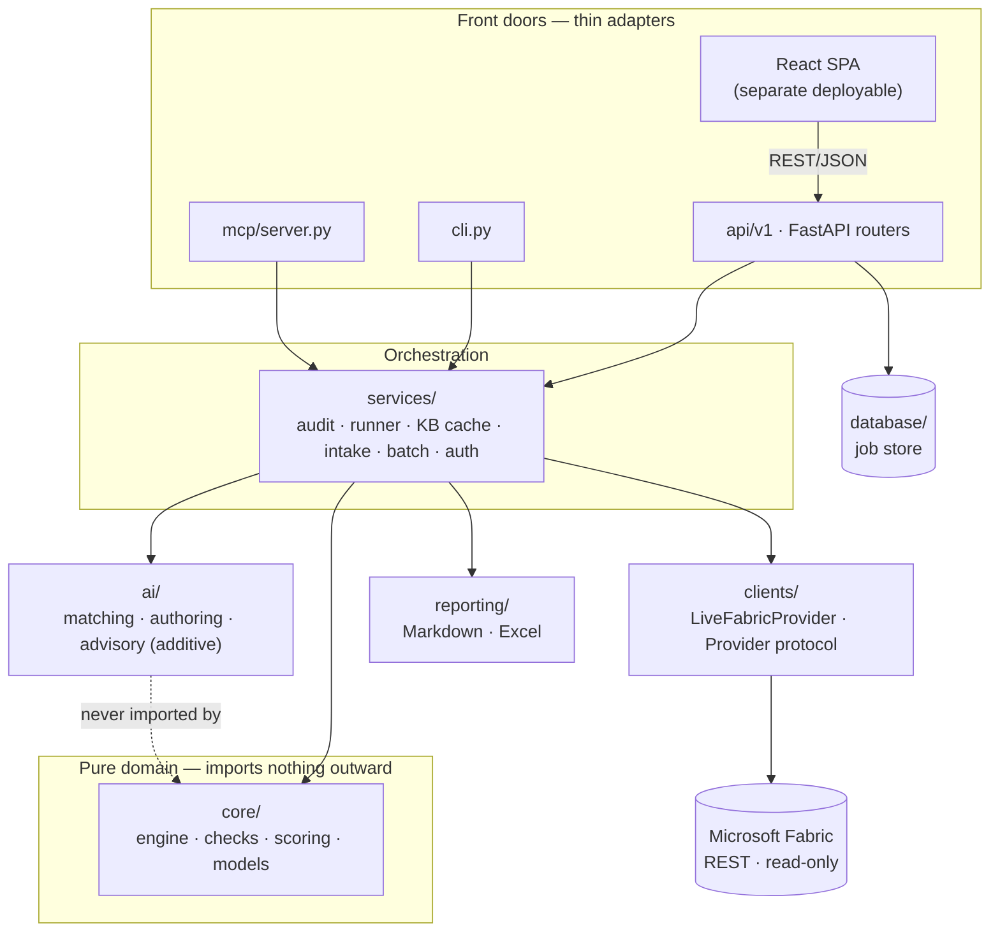
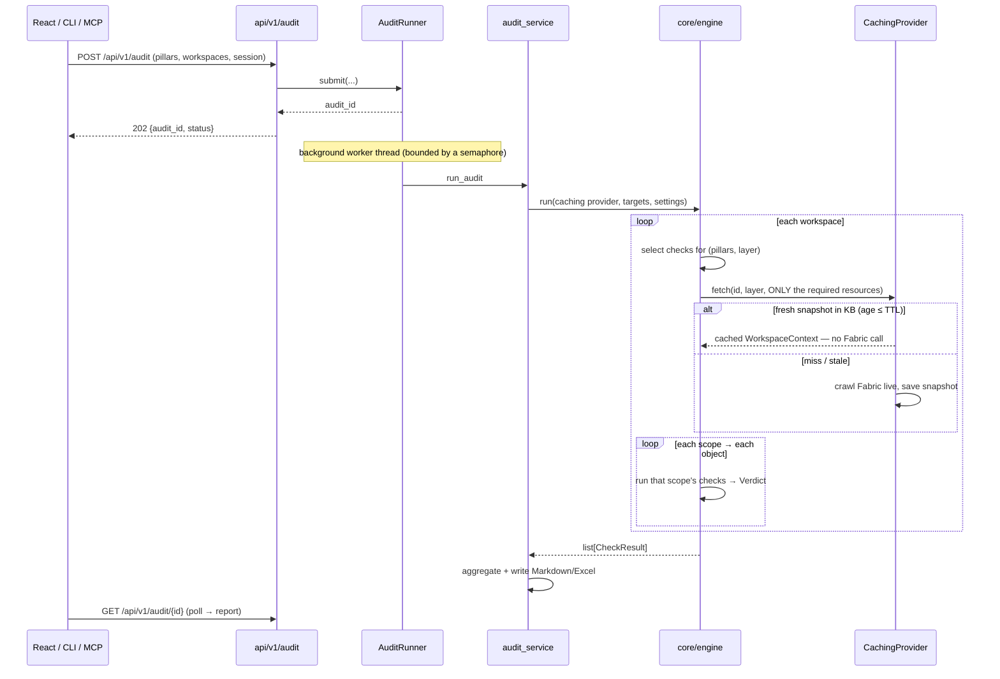
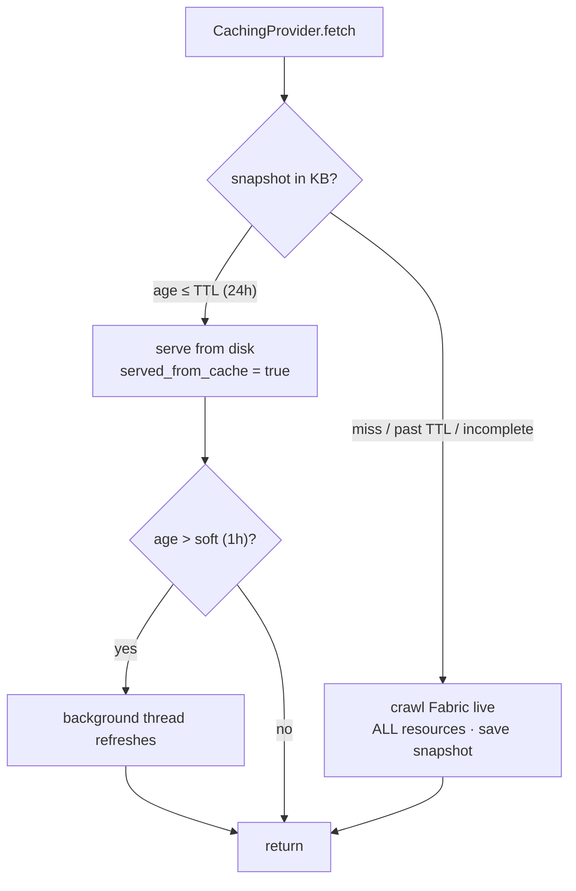
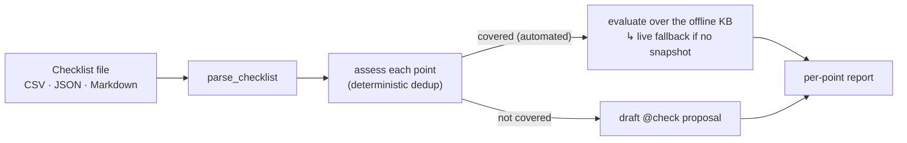
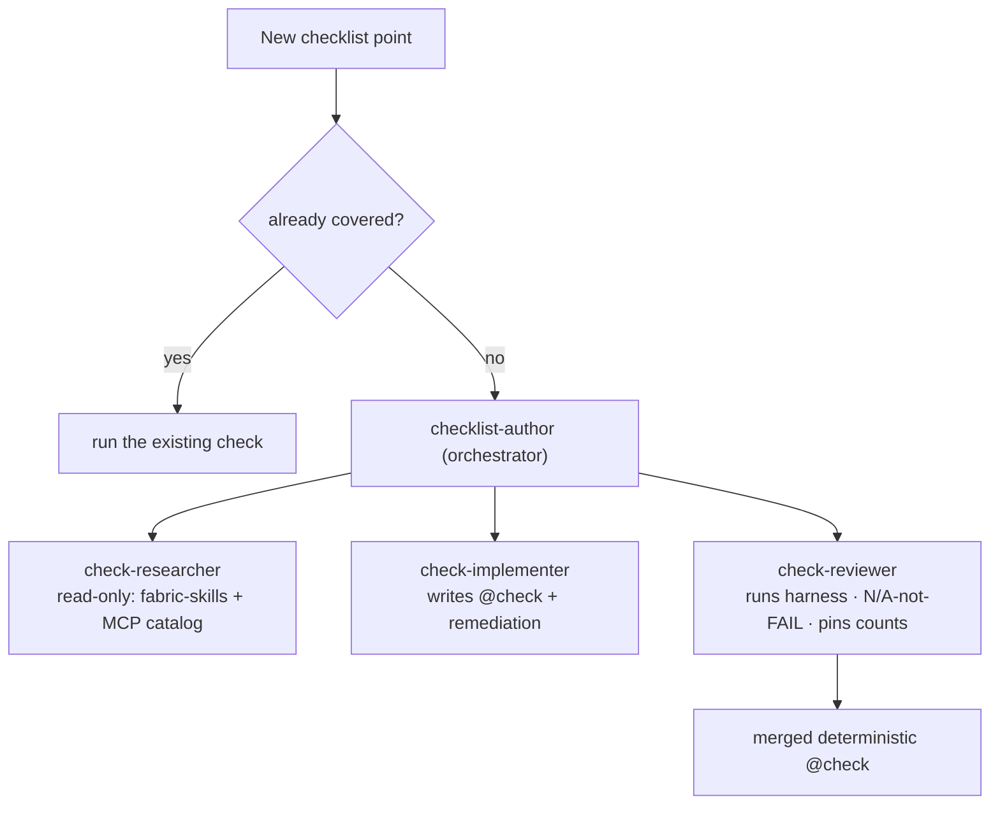

# Architecture — Microsoft Fabric Well-Architected Auditor

> **A showcase, in-depth walkthrough of how this platform is built and why.**
> This is the flagship overview; the developer-reference deep dives live in
> [`docs/`](docs/README.md) ([architecture](docs/architecture.md) ·
> [checks](docs/checks.md) · [scoring](docs/scoring.md) · [api](docs/api.md) ·
> [scalability](docs/scalability.md)). New here? Read this top-to-bottom, then
> jump to a `docs/` file when you want the fine grain.

---

## 1. What it is, in one breath

A **rule-based, read-only, fully deterministic** platform that audits Microsoft
Fabric workspaces against a **7-pillar Well-Architected model**. Every check is a
fixed rule with a fixed threshold and pre-written remediation, so **the same input
always produces the same score**. There is no LLM anywhere in the scoring path.

It answers one question, repeatably and defensibly: *"Do these Fabric workspaces,
pipelines, and notebooks follow best practice — and exactly where do they fall
short?"*



---

## 2. The five design guarantees (why it can be trusted)

These are load-bearing invariants, not aspirations. Everything below is arranged
to protect them.

| # | Guarantee | How it is enforced |
|---|-----------|--------------------|
| **1** | **Deterministic scoring.** Same input → same score, forever. | A check is a **pure function** of its input. No clock, no randomness, no network, no LLM in a check body. |
| **2** | **Read-only.** The tool never writes to a tenant. | Only HTTP `GET` + the read-only `getDefinition`. No write path exists in the client. |
| **3** | **"Could not read" ≠ "misconfigured".** | A check reports **N/A, never FAIL**, when its data was unavailable. A permission gap can never masquerade as a low score. |
| **4** | **One brain, many front doors.** REST, CLI, and MCP never disagree. | All three are thin adapters over one `services/` layer; logic never lives in a router. |
| **5** | **AI is additive, never in the scoring path.** | The optional AI/intake layer can *suggest* and *draft*, but it can never register a check or move a number. |

The architectural expression of guarantees 1 and 4 is a strict **dependency
rule**: `core/` imports nothing outward — no web framework, no HTTP client, no
database. You can verify it mechanically:

```powershell
# Returns nothing — the audit engine has zero web/network dependency.
Select-String -Path backend/src/auditfast/core/*.py -Pattern "fastapi|flask|requests"
```

---

## 3. The domain model (the vocabulary everything shares)

Every dimension the tool reasons about is an enum defined exactly once in
[`core/enums.py`](backend/src/auditfast/core/enums.py).

| Term | Meaning |
|------|---------|
| **Project** | One engagement. Spans **one or more** Fabric workspaces. Defined by a YAML file. |
| **Workspace** | A Fabric workspace, audited as a unit. |
| **Layer** | The role a workspace plays: `Data Prep`, `Data Storage`, `Data Logs`, `Data Operations`, `Reporting / Semantic`, `Mixed`. The project's "inner pillars". |
| **Pillar** | One of **7**: Security · Governance & Compliance · Operations & Reliability · Performance & Capacity · Cost & Resource Optimization · Data Management & Quality · **Foundation** (cross-cutting, informational, **never scored**). |
| **Scope** | What a check inspects: `workspace`, `pipeline`, `notebook` (+ reserved `lakehouse`, `semantic_model`, `report`, `eventhouse`). |
| **Resource** | A unit of data the provider fetches. Checks declare `requires=[...]`; the engine fetches only the union the selected checks need. |
| **Automation** | How a verdict is reached: `automated` (verified now), `roadmap` (automatable but needs data not yet fetched — reported as an attestation), `manual` (never machine-verifiable). |
| **`ref`** | A dotted string like `2.4.1` pointing at the deep-dive checklist and used to look up remediation text — the **traceability spine** between the automated tool and the manual audit instrument. |

---

## 4. Layered architecture



**Arrows point inward.** `core/` is pure logic; `services/` orchestrates but knows
no web framework; the three front doors are interchangeable skins over the same
service calls. `ai/` sits *beside* the core and is never imported by it — that is
what keeps guarantee #5 true by construction.

### Module map (where things live)

| Path | Responsibility |
|------|----------------|
| [`core/enums.py`](backend/src/auditfast/core/enums.py) | Pillar, Layer, Scope, Resource, Status, Severity, Automation |
| [`core/models.py`](backend/src/auditfast/core/models.py) | `WorkspaceContext`, `CheckContext`, `CheckSpec`, `CheckResult` |
| [`core/engine.py`](backend/src/auditfast/core/engine.py) | Generic, scope-driven dispatch |
| [`core/scoring.py`](backend/src/auditfast/core/scoring.py) | 0–3 bands → weighted roll-up → pillar × layer matrix |
| [`core/check/`](backend/src/auditfast/core/check/) | The 148-check library + registry + verdict helpers |
| [`clients/`](backend/src/auditfast/clients/) | `LiveFabricProvider` (the only shipped provider) + the `Provider` protocol |
| [`services/`](backend/src/auditfast/services/) | The one audit path, the KB cache, the checklist intake + batch runner, auth, catalog |
| [`ai/`](backend/src/auditfast/ai/) | Deterministic dedup + proposal drafting; optional advisory (off by default) |
| [`api/v1/`](backend/src/auditfast/api/v1/) | FastAPI routers — the REST surface |
| [`mcp/server.py`](backend/src/auditfast/mcp/server.py) | MCP tools over the same services |
| [`reporting/`](backend/src/auditfast/reporting/) | Markdown + Excel writers |
| [`.github/`](.github/README.md) | The **agentic authoring layer** — how Copilot safely extends coverage (§11) |

---

## 5. The runtime — what happens during an audit

Audits are **fire-and-poll**: the API returns an `audit_id` immediately (202), the
work runs in a background worker thread, and the client polls until it is done.



**Three decisions worth calling out:**
- **Fire-and-poll** because a tenant-wide crawl issues many sequential Fabric
  calls and can take minutes — a synchronous endpoint would time out at any
  gateway in front of it.
- **A worker thread behind a semaphore** because `run_audit` is synchronous and
  I/O-bound; running it inline would block the async event loop and stall every
  other request.
- **A knowledge-base cache** so repeat runs are near-instant (§7).

---

## 6. The engine is generic; the checks carry the knowledge

The engine ([`core/engine.py`](backend/src/auditfast/core/engine.py)) knows nothing
about any specific check, pillar, or artifact type. It dispatches purely on `Scope`:

```python
for workspace_id, layer in targets:
    specs = registry.select(pillars=..., layer=layer)     # filter BEFORE fetch
    resources = registry.required_resources(specs)        # union of what's needed
    workspace = provider.fetch(workspace_id, layer, resources)
    for scope in registry.scopes(specs):
        for obj_name, obj in workspace.objects(scope):
            for spec in specs_for(scope):
                emit(spec.fn(CheckContext(workspace, settings, obj_name, obj)))
```

A **check** declares all its metadata at registration and returns a tiny `Verdict`
— a score plus the evidence for it. The engine combines that with the registered
`CheckSpec` to build the full result, which is why a check body is three lines, not ten:

```python
@check(id="PL-RETRY", ref="2.4.1", title="Retry policy configured on activities",
       pillar=Pillar.OPERATIONS, scope=Scope.PIPELINE, severity=Severity.HIGH,
       layers=PIPELINE_LAYERS, requires=[Resource.PIPELINE_DEFINITIONS])
def retry_policy(ctx: CheckContext) -> Verdict:
    """Activities that call external systems retry before failing."""
    if not ctx.workspace.has(Resource.PIPELINE_DEFINITIONS):
        return not_applicable("Pipeline definitions could not be read from Fabric")
    acts = activities(ctx.obj)
    with_retry = [a for a in acts if (a.get("policy") or {}).get("retry", 0) >= 1]
    return covered(len(with_retry), len(acts),
                   f"{len(with_retry)} of {len(acts)} activities have a retry policy")
```

**Five verdict helpers** ([`core/check/helpers.py`](backend/src/auditfast/core/check/helpers.py))
cover every check: `binary(ok, ev)` → 3/0 · `covered(n, total, ev)` → banded ratio
· `graded(0–3, ev)` · `note(ev)` → INFO, unscored · `not_applicable(ev)` → N/A,
unscored. That last one is guarantee #3, in code.

**Registration is an import side effect.** The `@check` decorator registers into a
process-wide `REGISTRY` at import time; the package auto-discovers every leaf
module named `automated` / `manual` / `roadmap` and imports it. A module not
imported (or hidden behind a `_` prefix) registers nothing — so `/health` reports
`checks_registered` and a test pins the count, making an empty catalog *visible*
rather than silent.

### Current coverage

**148 checks — 64 `automated`, 84 `roadmap`, 0 `manual`.**

| Pillar | Checks | | By scope | Checks |
|--------|-------:|-|----------|-------:|
| Data Management & Quality | 53 | | workspace | 107 |
| Operations & Reliability | 33 | | notebook | 29 |
| Performance & Capacity | 23 | | pipeline | 12 |
| Security | 16 | | | |
| Cost & Resource Optimization | 15 | | | |
| Governance & Compliance | 7 | | | |
| Foundation (unscored) | 1 | | | |

`roadmap` checks are honest placeholders: automatable *in principle*, but needing
an API the provider does not yet call (tenant-admin, capacity metrics, an
un-crawled definition). They appear in the catalog as attestations so no checklist
point is silently missing — and are promoted to `automated` as data becomes reachable.

---

## 7. The knowledge-base cache and permanent archive

A full live crawl is dominated by `getDefinition` — one call per notebook and per
pipeline. So the provider the engine actually receives is a **`CachingProvider`**
([`services/context_store.py`](backend/src/auditfast/services/context_store.py))
wrapping the live provider and an on-disk **knowledge base** (one JSON snapshot per
workspace under `kb-cache/`).



- **Two freshness windows.** A hard **TTL** (default 24h — older snapshots
  re-crawl inline) and a soft window (default 1h — served instantly, refreshed in
  the background). "Show cached now, refresh silently."
- **Completeness-aware.** Every per-item read is classified `forbidden` (401/403 —
  won't recover) or `transient` (429/5xx/timeout — may recover), recorded on
  `WorkspaceContext.read_failures`. An **incomplete snapshot is never cached** — so
  a permission or throttle gap is not frozen into a believable-looking low score;
  it surfaces as a visible `WS-READ-INCOMPLETE` warning in the report's *Crawl
  completeness* section instead.
- **Permanent archive.** Independently, an **`ArchivingProvider`** writes a fresh,
  timestamped snapshot **every run** to `Fabric workspace kb/<ws>/<ws>_<timestamp>/`.
  It never overwrites, so the full crawl history is retained for audit trails.

---

## 8. Scoring — 0–3 to a defensible percentage

Deterministic and rubric-driven ([`core/scoring.py`](backend/src/auditfast/core/scoring.py)):

- **Coverage band:** 100% → 3 · 80–99% → 2 · 50–79% → 1 · below 50% → 0.
- **Weighted roll-up:** `percentage = Σ(score × weight) / Σ(MAX × weight) × 100`.
  Every check currently carries `weight = 1.0`, so this reduces to an unweighted
  mean — the mechanism exists so per-check weighting can be a *policy* decision
  later, not a rewrite.
- **Rating bands (risk-oriented):** 0–40 Critical · 41–60 High · 61–75 Medium ·
  76–90 Good · 91–100 Excellent.
- **Outputs:** one overall score, a per-pillar scorecard, a per-workspace
  breakdown, and a **pillar × layer matrix** — plus a *Not assessed* view so N/A
  never masquerades as a zero.

---

## 9. Security & authentication

Read-only throughout, via a **delegated OAuth2 bearer token** (MSAL). Three ways in
— interactive browser, an existing `az login` (no app registration needed), or
device code for CLI/headless — all yielding the same delegated token.

- **The token never leaves the server.** The browser holds only an opaque session
  id, so a compromised browser cannot yield a Fabric access token.
- **Ordinary delegated access is the design target.** Workspace, items, roles, Git
  state, and notebook/pipeline/model definitions all read with normal workspace
  access — **tenant-admin is not required**. Checks whose data genuinely needs
  admin/capacity/audit-log APIs are `roadmap` attestations, not guesses.

---

## 10. The three front doors + the SPA

One service layer, three adapters — they cannot produce different numbers.

| Front door | For | Notes |
|------------|-----|-------|
| **REST API** ([`api/v1/`](backend/src/auditfast/api/v1/)) | The web app and any client | FastAPI + Pydantic v2; fire-and-poll audits |
| **CLI** ([`cli.py`](backend/src/auditfast/cli.py)) | Scripts, CI, headless | `auditfast run` / `checks` / `serve` / `checklist` |
| **MCP** ([`mcp/server.py`](backend/src/auditfast/mcp/server.py)) | AI agents & Copilot | Catalog, checklist, and audit tools over the same services |

The **frontend** is a completely separate React 18 + TypeScript + Vite + Tailwind +
Axios deployable. The API returns JSON only; `src/types/api.ts` mirrors the Pydantic
schemas, and `src/services/` is the only layer that touches the API.

---

## 11. Beyond auditing — the two additive capabilities

The platform is not just a scorer. Two capabilities sit *beside* the deterministic
engine, and neither can ever move a score.

### 11a. Checklist intake + batch runner — "run *your* checklist"

A client can bring their **own** best-practice checklist and answer, token-free,
from the registered catalog:



- **Single point** → `POST /api/v1/checklist/assess`: is this already covered? If
  not, get a ready-to-edit `@check` proposal.
- **Whole file** → `POST /api/v1/checklist/batch` (also CLI `auditfast checklist`,
  the MCP `assess_checklist_batch` tool, and a drag-and-drop page): dedup every
  point and **evaluate the covered automated checks over the offline knowledge
  base**, falling back to a live read only for a workspace with no snapshot.
- **Additive by construction:** it never registers a check and never changes a
  score. Deterministic matcher; the optional model advisory is off by default.

### 11b. The agentic authoring layer — how coverage grows safely

The [`.github/`](.github/README.md) folder is the "brain" that lets GitHub Copilot
turn a plain-language checklist point into a real, merged, deterministic `@check` —
**without ever touching a running audit**.



It ships as a complete, self-describing kit: **agents** (the multi-agent workflow),
a **cookbook instruction** enumerating every Pillar/Layer/Scope/Resource/helper +
worked examples, a **fabric-skills reference map**, an executable **harness**
(`validate_check.py` + pytest + ruff), **MCP** wiring, and **prompts**
(`/add-check`, `/run-checklist`). The guarantee matches the engine's: a generated
check only runs after a human merges it, and it must report **N/A, not FAIL**, on
missing data — so extending coverage can never make an existing run start failing.

---

## 12. Extensibility — the three ways to grow

| I want to… | I touch | The engine… |
|------------|---------|-------------|
| **Add a rule** | one `@check` function under `core/check/<pillar>/<layer>/` | …picks it up automatically (import side effect) |
| **Add a data source** | one `Provider.fetch` implementation in `clients/` | …does not change — it just calls `fetch` |
| **Add an artifact type** | a `Scope` member + a provider that yields it | …dispatches on the new scope generically |

That symmetry — new rule, new source, new artifact each isolated to one seam — is
the payoff of the pure-core + generic-engine design.

---

## 13. Quality & determinism in practice

- **185 tests, fully offline.** The suite runs against a recorded-tenant fixture —
  no live Fabric call — so determinism is *tested*, not merely intended. Pinned
  values (`checks_registered`, the overall score, scored-check and result-row
  counts) fail loudly if any check, band, or roll-up drifts.
- **`ruff` lint** on the whole backend.
- **The N/A-not-FAIL rule is enforced** by the harness on every new check, so
  extending coverage is guaranteed additive.

---

## 14. Technology stack

| Layer | Technology |
|-------|-----------|
| Frontend | React 18 · TypeScript · Vite · Tailwind · Axios |
| API | FastAPI · Pydantic v2 · uvicorn |
| Domain | Pure Python — zero framework dependency |
| Auth | MSAL · read-only delegated Entra scopes (token server-side) |
| Agents / tooling | Model Context Protocol (FastMCP) · GitHub Copilot authoring layer |
| Reports | Markdown · Excel (openpyxl) |
| Persistence | On-disk knowledge base (JSON) + permanent timestamped archive |
| Tests | pytest + FastAPI TestClient — 185, fully offline |

---

## 15. What makes it different

- **Deterministic and defensible.** A rule engine, not a chatbot — the same tenant
  always scores the same, and every finding cites a checklist `ref` with
  pre-written remediation. Boardroom- and auditor-grade.
- **Read-only and permission-honest.** It never writes to a tenant, needs no
  admin, and distinguishes "could not read" from "misconfigured" — so it is safe
  to point at a production tenant.
- **Fast on repeat runs.** The on-disk knowledge base makes the second audit
  near-instant and keeps a permanent, timestamped crawl history.
- **Extensible by design, and safely.** One engine behind three front doors; new
  rules, data sources, and artifact types each drop into a single seam; and an
  agentic authoring layer lets coverage grow **without** the AI ever touching a score.

---

*This document is the showcase overview. For implementation-level detail see
[`docs/architecture.md`](docs/architecture.md), and for the orientation every
contributor reads first, [`AGENTS.md`](AGENTS.md).*
