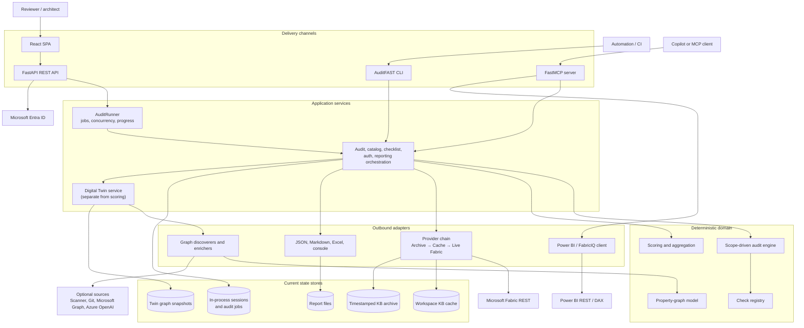
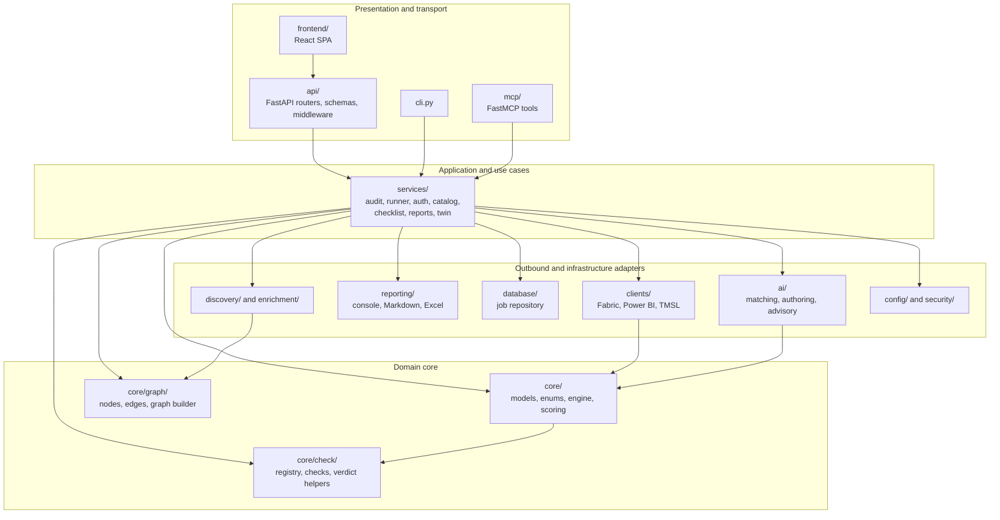
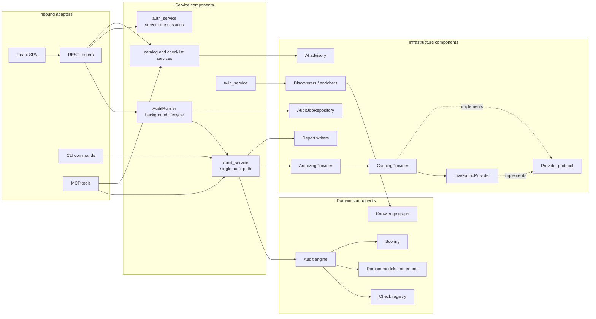
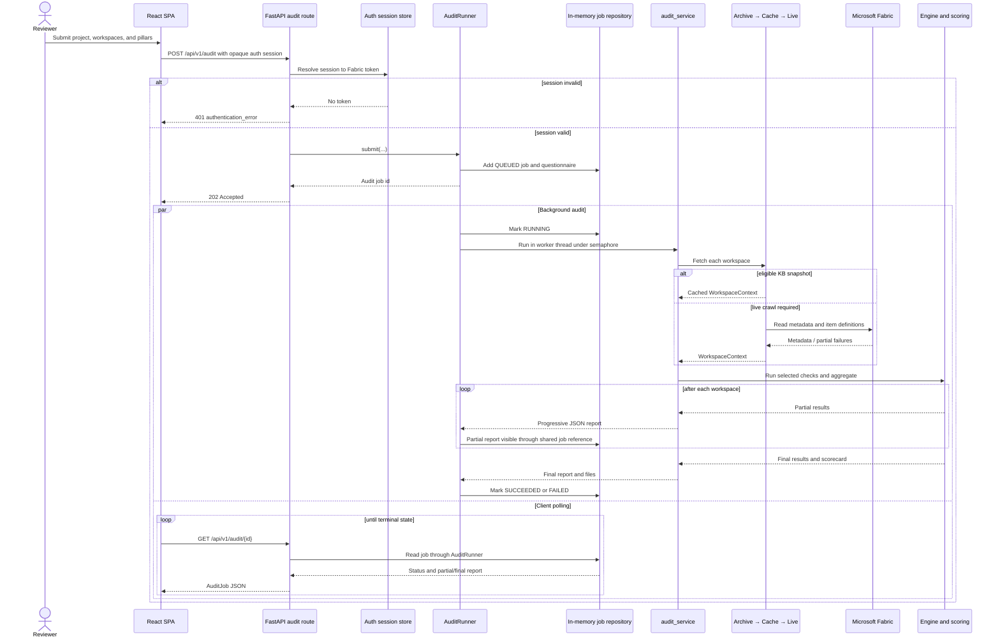
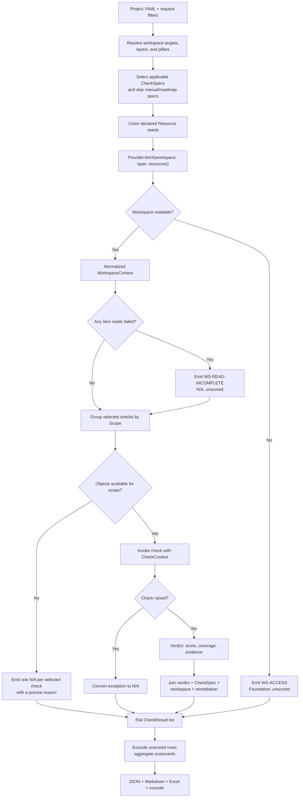
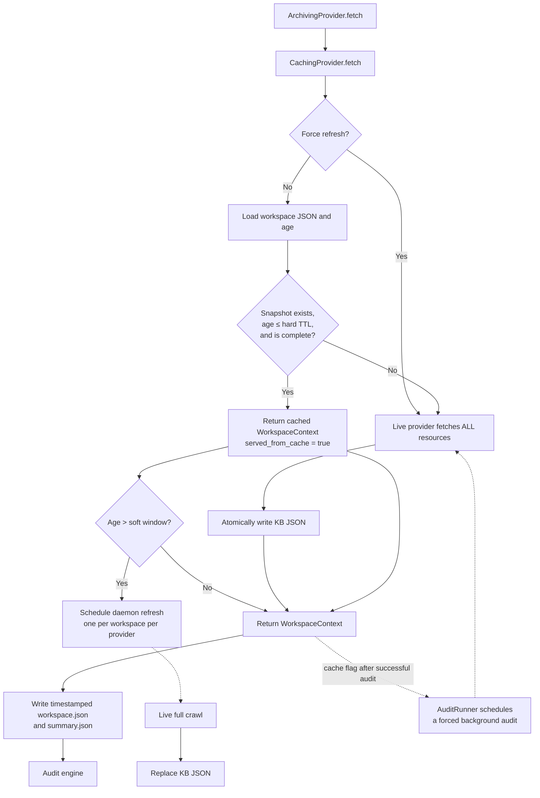
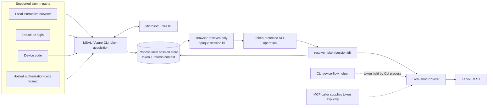
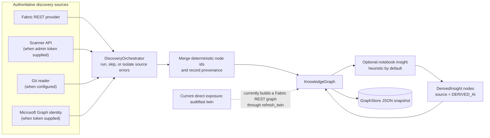
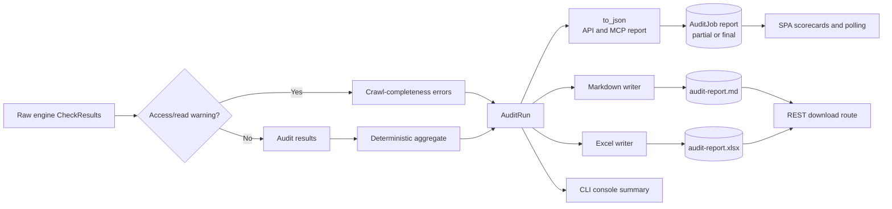
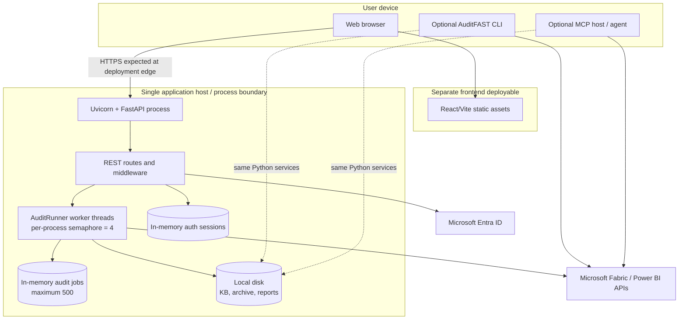

# Architecture Document — Microsoft Fabric Well-Architected Auditor

> **System:** AuditFAST Core  
> **Document type:** Enterprise solution architecture  
> **Implementation baseline:** `auditfast` 0.4.0  
> **Last verified:** 2026-08-03

---

## 0. Document Control

| Field | Value |
|---|---|
| Document status | Proposed for enterprise review |
| Architecture owner | AuditFAST Engineering |
| Intended approver | Solution Review Board / Enterprise Architecture Review Board |
| Intended audience | Enterprise architects, technical architects, engineering managers, senior developers, new team members, security reviewers, and operations teams |
| Scope | The packaged implementation under `backend/src/auditfast/` and the React application under `frontend/` |
| Viewpoint | Hybrid arc42 structure with C4-style context, container, component, runtime, deployment, data, and security views |
| Review cadence | At each major release, or when a trust boundary, persistence model, scoring rule, or deployment topology changes |
| Sources of truth | The implementation, automated tests, runtime check catalog, and this document, in that order |

This document describes the architecture that exists in the repository. Planned
changes are labelled as future work and are not shown as current capability.
Exact check counts are dated because the catalog is designed to evolve. The
runtime catalog remains the authoritative source for current coverage.

### Review posture

The deterministic audit design is suitable for approval as a single-instance,
read-only assessment platform. Its domain boundaries, failure semantics, and
extension points are sound.

Approval for an internet-exposed, multi-tenant, or multi-replica production
service should be conditional on the security and durability work identified in
[Known Limitations and Technical Debt](#26-known-limitations-and-technical-debt):
application-level authorization, shared session and job storage, per-audit report
isolation, data-retention controls, and a shared cache strategy.

---

## Contents

1. [Executive Summary](#1-executive-summary)
2. [Business Problem and Drivers](#2-business-problem-and-drivers)
3. [Solution Overview](#3-solution-overview)
4. [Goals, Scope, Stakeholders, and Constraints](#4-goals-scope-stakeholders-and-constraints)
5. [Design Principles](#5-design-principles)
6. [Technology Stack](#6-technology-stack)
7. [Domain Model and Glossary](#7-domain-model-and-glossary)
8. [Overall and Layered Architecture](#8-overall-and-layered-architecture)
9. [Component Responsibilities](#9-component-responsibilities)
10. [Runtime Flow](#10-runtime-flow)
11. [Audit Flow](#11-audit-flow)
12. [Data Architecture and Data Flow](#12-data-architecture-and-data-flow)
13. [Knowledge Base and Caching](#13-knowledge-base-and-caching)
14. [Provider Pattern and Fabric Access](#14-provider-pattern-and-fabric-access)
15. [Core Engine, Checks, and Scoring](#15-core-engine-checks-and-scoring)
16. [Authentication and Authorization](#16-authentication-and-authorization)
17. [AI and Digital Twin Capabilities](#17-ai-and-digital-twin-capabilities)
18. [Model Context Protocol and FabricIQ](#18-model-context-protocol-and-fabriciq)
19. [Reporting Architecture](#19-reporting-architecture)
20. [Deployment Architecture](#20-deployment-architecture)
21. [Security Architecture](#21-security-architecture)
22. [Error Handling](#22-error-handling)
23. [Logging and Monitoring](#23-logging-and-monitoring)
24. [Performance, Scalability, and Resilience](#24-performance-scalability-and-resilience)
25. [Architecture Decisions and Trade-offs](#25-architecture-decisions-and-trade-offs)
26. [Known Limitations and Technical Debt](#26-known-limitations-and-technical-debt)
27. [Future Enhancements](#27-future-enhancements)
28. [Extensibility and Developer Orientation](#28-extensibility-and-developer-orientation)
29. [Appendices](#29-appendices)

---

## 1. Executive Summary

AuditFAST is a read-only assessment platform for Microsoft Fabric. It inspects
workspace metadata and item definitions, applies a fixed library of
Well-Architected checks, and produces evidence-backed findings and scorecards.

The central design choice is **determinism**: given the same normalized workspace
snapshot, project settings, check library, and remediation book, the audit
produces the same verdicts and scores. A language model is not involved in this
path. This makes a result repeatable, reviewable, and suitable for comparison
across environments and over time.

The system uses a ports-and-adapters architecture:

- a pure domain core owns checks, verdicts, and scoring;
- a provider converts external data into one normalized workspace snapshot;
- a framework-free service layer coordinates audits;
- REST, command-line, and Model Context Protocol interfaces reuse those services;
- report writers render the same results as JSON, Markdown, Excel, or console
  output.

Two additive capabilities sit beside the audit engine:

1. **Checklist intake and authoring support** compare a client-supplied practice
   with the existing catalog and can draft a proposal for human review.
2. **A Digital Twin subsystem** can represent a Fabric workspace as a property
   graph and enrich it with derived insights.

Neither capability can alter a score. The Digital Twin is currently isolated
from the audit path and exposed directly only through the command-line interface.

The architecture is strongest in separation of concerns, offline testability,
permission-honest failure handling, and safe extensibility. Its principal risks
are operational rather than domain-related: process-local sessions and jobs,
local-disk state, sequential item-definition reads, fixed report filenames, and
incomplete application-level authorization for hosted use.

---

## 2. Business Problem and Drivers

### 2.1 The problem

A Microsoft Fabric estate is rarely one workspace. A project may separate data
preparation, storage, operations, logs, and reporting into different workspaces.
Reviewing that estate manually creates four recurring problems:

- **Inconsistent judgement.** Different reviewers can interpret the same
  practice differently.
- **Weak traceability.** A score without observed evidence and a remediation
  reference is difficult to defend.
- **High collection cost.** Reading every notebook, pipeline, model, role, and
  workspace property repeatedly is slow and can trigger API throttling.
- **False certainty.** A permission failure can look like an empty or
  misconfigured workspace unless unavailable data is modelled explicitly.

The platform addresses these problems at an architecture and best-practice
level. It does not attempt to replace data profiling, lineage analysis, legal
review, or a line-by-line review of business logic.

### 2.2 Business outcomes

The intended outcomes are:

- a repeatable baseline for Fabric architecture reviews;
- consistent scoring across projects, workspaces, and delivery channels;
- findings that contain the observed evidence, affected object, severity, and
  recommended action;
- rapid repeat audits using a cached workspace knowledge base;
- a clear distinction between non-compliance and data that could not be read;
- a controlled way to expand coverage without introducing adaptive behaviour
  into the scoring path.

### 2.3 Architecture drivers

| Driver | Architectural response |
|---|---|
| Results must be defensible | Pure checks, fixed thresholds, explicit evidence, and checklist references |
| The tenant must not be changed | Read-only clients; no Fabric mutation operation is implemented |
| Permissions vary by user and workspace | Unavailable resources and partial reads become unscored N/A results |
| A live crawl can take minutes | Fire-and-poll API, worker threads, bounded concurrency, and disk caching |
| The same logic must serve people and agents | REST, CLI, and MCP remain thin adapters over one service layer |
| Coverage will grow | Registry metadata, provider contracts, generic scope dispatch, and authoring safeguards |
| AI may add value without weakening trust | AI and derived graph insights are kept outside deterministic scoring |

---

## 3. Solution Overview

An audit starts with a project definition. The project identifies one or more
Fabric workspaces and assigns each a role, called a **layer**. A reviewer may
further restrict the run to selected Well-Architected pillars.

The engine selects the applicable checks before execution. Each check declares
the data it requires. The provider returns a normalized `WorkspaceContext`, the
engine invokes checks against workspace or item objects, and each check returns a
small verdict containing a score and evidence. The service layer then adds
metadata and remediation, aggregates the results, and renders the report.

### 3.1 Overall Architecture

The diagram shows two deliberate boundaries:

- the deterministic audit path ends at checks and scoring;
- the Digital Twin, checklist advisory, and model-assisted functions are
  additive paths and do not feed scores.

---

## 4. Goals, Scope, Stakeholders, and Constraints

### 4.1 Architecture goals

1. **Repeatability.** The same normalized input must produce the same score.
2. **Read-only operation.** Auditing must not mutate Fabric or Power BI content.
3. **Permission honesty.** Unknown data must never be treated as absent data.
4. **One implementation.** REST, CLI, and MCP must use the same domain and
   service logic.
5. **Evidence and traceability.** Every result must identify what was observed
   and which checklist point it represents.
6. **Efficient repeat execution.** A prior complete snapshot should avoid a
   blocking tenant crawl.
7. **Safe extension.** New rules and integrations must enter through explicit
   seams and remain testable offline.
8. **Operational visibility.** Long-running work and partial reads must be
   visible rather than silently omitted.

### 4.2 In scope

- project-level audits across one or more Fabric workspaces;
- workspace, pipeline, and notebook checks currently executed by the engine;
- reserved support for lakehouse, semantic-model, report, and eventhouse scopes;
- Fabric metadata, roles, Git state, item inventory, item definitions, table
  listings, shortcuts, and parsed semantic-model facts;
- fixed 0–3 verdicts, weighted aggregation, and pillar-by-layer analysis;
- REST, CLI, MCP, browser, Markdown, Excel, and console delivery;
- checklist intake, check-authoring support, FabricIQ tools, and the isolated
  Digital Twin capability.

### 4.3 Out of scope

- writing changes back to a Fabric tenant;
- row-level data-quality profiling;
- complete end-to-end data lineage;
- semantic validation of business rules;
- legal, contractual, and organisational-process certification;
- autonomous creation or activation of scoring rules;
- an LLM-generated score or remediation decision;
- a production-grade distributed job platform in the current release.

### 4.4 Stakeholders and concerns

| Stakeholder | Primary concern | Where it is addressed |
|---|---|---|
| Audit reviewer | Fair scoring, evidence, N/A handling | Core engine, scoring, reporting |
| Enterprise architect | Boundaries, decisions, trade-offs, evolution | Overall architecture, decisions, roadmap |
| Security reviewer | Token handling, access control, sensitive metadata | Authentication, authorization, security architecture |
| Engineering manager | Maintainability, delivery risk, testability | Layering, component responsibilities, limitations |
| Senior developer | Contracts, runtime flow, extension seams | Provider, engine, component, and extensibility sections |
| Operations team | Long-running work, health, logs, recovery | Deployment, monitoring, resilience |
| Check author | Determinism, required data, remediation, registration | Core engine and extensibility sections |
| Agent or automation owner | Stable machine interfaces and token boundaries | REST, CLI, MCP, and reporting sections |

### 4.5 Constraints

- The domain core cannot depend on FastAPI, an HTTP client, a database, or the
  AI packages.
- Checks must be pure functions of their `CheckContext`.
- The platform may issue read operations only. Fabric `getDefinition` is a POST
  by protocol but reads content and does not change it.
- A missing permission or failed API read must result in N/A, not a score of zero.
- The normal authentication model uses delegated Microsoft identity.
- Tests must run without contacting a live tenant.

### 4.6 Current assumptions

- One API process owns its sessions, jobs, worker semaphore, and local files.
- The host filesystem is writable and trusted.
- The signed-in identity already has access to the selected workspaces.
- Fabric and Entra endpoints are reachable from the host.
- Local filesystem controls provide the current protection for cached item
  definitions and reports.
- No formal availability, recovery-time, recovery-point, or throughput service
  level has yet been approved.

---

## 5. Design Principles

### 5.1 Deterministic scoring

Checks contain fixed logic and thresholds. No clock, randomness, network call,
or language model is permitted in a check body. Determinism applies to verdicts
and scores for a fixed snapshot. Operational metadata such as report dates,
archive timestamps, and live tenant state naturally changes over time.

### 5.2 Read-only by construction

The Fabric client implements GET operations and the read-only `getDefinition`
operation. FabricIQ can issue read-only DAX `EVALUATE` queries. There is no
create, update, delete, refresh, or deployment action in the audit path.

The delegated permission named `Item.ReadWrite.All` is broader than the
operations used. It is requested because Fabric currently gates
`getDefinition` behind that permission, not because the application writes.

### 5.3 Unknown is not non-compliant

The system represents unavailable resources explicitly. It records whether a
failure was permission-related or transient, excludes the affected result from
scoring, and explains the gap in the report.

### 5.4 One brain, several interfaces

The service layer is the only audit orchestration path. REST, CLI, and MCP adapt
their transport conventions to that layer rather than reimplementing the audit.

### 5.5 Normalize at the boundary

Providers translate external payloads into `WorkspaceContext`. Checks do not
parse HTTP responses or know which source supplied the data. This keeps the core
portable and makes offline fixtures equivalent to live inputs.

### 5.6 Metadata before execution

A check declares its pillar, scope, applicable layers, required resources,
severity, weight, and remediation reference at registration time. The system can
therefore list, filter, cost, and select checks before any tenant read occurs.

### 5.7 AI remains advisory

Model-generated text and derived graph insights are explicitly separated from
authoritative facts. An AI outage degrades to deterministic fallback text and
cannot change a running audit.

### 5.8 Fail locally, report globally

A broken check becomes an N/A row. A failed archive write is logged. A failed
background refresh does not invalidate the report already returned. The design
isolates faults while preserving evidence that something could not be completed.

---

## 6. Technology Stack

| Concern | Current technology | Architectural role |
|---|---|---|
| Backend language | Python 3.10 or later | Domain, services, adapters, and reporting |
| REST API | FastAPI, Pydantic v2, Uvicorn | JSON API, validation, dependency injection, OpenAPI |
| Fabric transport | `requests` | Synchronous Fabric and Power BI HTTP access |
| Identity | MSAL and Azure CLI integration | Delegated Entra token acquisition and refresh |
| Frontend | React 18, TypeScript, Vite, React Router | Separate browser application |
| Styling | Tailwind CSS | Browser presentation |
| Browser transport | Axios | Central API client and error normalization |
| Reports | Python Markdown generation and openpyxl | Human-readable and spreadsheet outputs |
| Configuration | Pydantic Settings, YAML | Environment settings and project definitions |
| Agent interface | FastMCP 1.x, optional dependency | Model Context Protocol tools |
| Optional advisory AI | Azure OpenAI client | Unscored checklist prose only |
| Persistence today | In-memory dictionaries and local JSON/files | Jobs, sessions, cache, archive, graph, reports |
| Testing | pytest, FastAPI TestClient, recorded fixtures | Offline deterministic verification |
| Static quality | Ruff and TypeScript compiler | Backend lint and frontend type checking |

The Python package is built from `backend/src`, as declared in
[backend/pyproject.toml](backend/pyproject.toml). The similarly named
`backend/auditfast/` tree is not packaged and is treated as legacy code.

---

## 7. Domain Model and Glossary

The domain vocabulary is defined once in
[backend/src/auditfast/core/enums.py](backend/src/auditfast/core/enums.py) and
carried through API schemas and reports.

| Term | Plain-language meaning |
|---|---|
| **Project** | One audit engagement. It groups settings and one or more workspaces. |
| **Workspace** | A Microsoft Fabric workspace assessed as one unit. |
| **Layer** | The role a workspace plays: Data Prep, Data Storage, Data Logs, Data Operations, Reporting / Semantic, or Mixed. |
| **Pillar** | A Well-Architected quality area. Six pillars are scored; Foundation is informational. |
| **Scope** | The kind of object a check inspects, such as a workspace, pipeline, or notebook. |
| **Resource** | A named unit of provider data, such as item inventory, roles, Git state, or notebook definitions. |
| **Provider** | An adapter that turns an external source into a normalized workspace snapshot. |
| **WorkspaceContext** | The normalized, read-only snapshot consumed by every check. |
| **CheckSpec** | Registration-time metadata describing a check before it runs. |
| **CheckContext** | The workspace, object, and project settings given to one check invocation. |
| **Verdict** | A check's small answer: score, evidence, coverage, and scored/unscored state. |
| **CheckResult** | A verdict combined with check metadata, workspace identity, severity, and remediation. |
| **N/A** | Not assessed. The result is recorded but excluded from scoring. |
| **Foundation** | An unscored pillar used for inventory and crawl/access warnings. |
| **Reference (`ref`)** | A stable checklist identifier and remediation lookup key. |
| **Automated check** | A check evaluated now from provider data. |
| **Roadmap check** | A catalogued practice that could be automated when more data is available; it is not executed today. |
| **Interactive check** | A fixed, scored questionnaire answered by a reviewer and merged after the crawl. The mechanism exists, but none are registered at this baseline. |
| **Manual check** | A catalog-only practice that cannot be determined by the engine. |
| **Knowledge base (KB)** | A disk snapshot of normalized workspace metadata. It is not a vector database or a generative-AI knowledge base. |
| **Digital Twin** | A separate property graph of workspace entities and relationships. It does not feed audit scores. |
| **Discoverer** | A Digital Twin adapter that contributes authoritative graph facts from one source. |
| **Enricher** | A graph processor that adds identity or derived insight after discovery. |
| **MCP** | Model Context Protocol, used to expose service functions as agent-callable tools. |
| **FabricIQ** | The local read-only Power BI/Fabric tool set exposed through MCP. |

### 7.1 Conceptual relationship

A project contains workspace targets. Each workspace has a layer. Checks belong
to a pillar and a scope, declare required resources, and return verdicts. The
engine turns those verdicts into results. Scoring aggregates only results that
carry a numeric score.

---

## 8. Overall and Layered Architecture

The design follows a ports-and-adapters, or hexagonal, structure. Business rules
sit at the centre. Transport and external-system details sit at the edge.

### 8.1 Layered architecture

The arrows express source dependencies, not runtime data volume. The important
rule is that `core/` imports nothing from the API, services, clients, database,
or AI packages. Outbound adapters are allowed to depend on core contracts; the
core is not allowed to depend on their implementations.

### 8.2 Why this structure was chosen

- The audit rules can run against a live tenant or an offline fixture without
  modification.
- Framework upgrades do not change scoring logic.
- A new interface cannot accidentally create a second scoring implementation.
- Persistence can be replaced behind repository and store contracts.
- Optional AI and graph features can evolve without weakening the audit
  boundary.

---

## 9. Component Responsibilities

### 9.1 Component Diagram

### 9.2 Responsibility map

| Component | Responsibility | Why it is needed |
|---|---|---|
| `frontend/` | Browser workflow, workspace selection, polling, scorecards, checklist intake | Keeps presentation independent from the API release unit |
| `api/` | HTTP validation, routing, dependency injection, middleware, error envelopes | Adapts web concerns without moving them into services |
| `cli.py` | Local and CI-oriented commands | Provides a headless interface over the same services |
| `mcp/` | Agent-callable tools | Makes catalog, audit, checklist, and Power BI functions available to agents |
| `services/audit_service.py` | Provider construction, engine invocation, aggregation, serialization, report writing | Establishes one audit implementation for every adapter |
| `services/audit_runner.py` | Job lifecycle, worker-thread execution, progress, concurrency, questionnaire merge, refresh | Prevents long crawls from blocking HTTP requests |
| `services/auth_service.py` | Entra flows, in-memory token sessions, silent refresh | Keeps Fabric tokens server-side for the browser path |
| `services/context_store.py` | KB persistence, cache policy, background refresh, archive | Makes repeat audits responsive and preserves snapshots |
| `core/models.py` | Provider and result contracts | Gives every adapter and check one stable data model |
| `core/engine.py` | Generic scope dispatch and failure conversion | Runs checks without knowing individual rule logic |
| `core/check/` | Catalog, decorators, helpers, and check functions | Holds the deterministic assessment knowledge |
| `core/scoring.py` | Score bands and roll-ups | Produces one consistent scorecard |
| `clients/live.py` | Fabric REST reads and definition parsing | Isolates Fabric protocol details from the domain |
| `clients/powerbi.py` and `clients/tmsl.py` | Power BI reads and model-fact extraction | Support semantic-model and FabricIQ use cases |
| `reporting/` | Markdown, Excel, and console projections | Separates presentation formats from scoring |
| `database/` | Audit-job model and repository contract | Makes current in-memory state replaceable |
| `ai/` | Deterministic matching and drafting; optional advisory text | Supports catalog growth without entering scoring |
| `core/graph/` | Property-graph model and graph builder | Represents a workspace as connected entities |
| `discovery/` | Multi-source graph ingestion and provenance | Adds graph facts without changing audit providers |
| `enrichment/` | Identity and derived graph insight | Keeps derived knowledge distinct from raw metadata |
| `schemas/` | Pydantic request and response contracts | Keeps transport schemas explicit and validated |
| `config/` | Environment settings and logging configuration | Centralizes operational configuration |
| `security/` | CLI device-code token acquisition | Supports terminal sign-in; currently duplicates part of API auth logic |

---

## 10. Runtime Flow

### 10.1 REST audit runtime sequence

The REST API uses **fire-and-poll**. A request is accepted quickly, the crawl runs
outside the event loop, and the client polls a job resource.

### 10.2 Job lifecycle

An `AuditJob` moves through `queued`, `running`, and then `succeeded` or
`failed`. A partial report may be present while the job is still running. If a
top-level failure occurs after some workspaces complete, the partial report is
retained with the failed state.

The runner executes synchronous I/O in `asyncio.to_thread`. A per-process
semaphore allows four audits to execute concurrently by default. Additional
submissions wait rather than creating unbounded Fabric traffic.

If the final report was served from an existing KB snapshot, the runner starts a
second background execution with `refresh=True`. The job remains succeeded while
its report is replaced with the refreshed result.

### 10.3 Other interfaces

- The CLI calls `audit_service.run_audit` synchronously after device-code sign-in.
- MCP audit tools call the same service synchronously because an MCP call is
  request/response and the caller supplies its own timeout.
- The single-check REST and MCP operations are synchronous and fetch only that
  check's declared resources unless a cold KB population intentionally performs
  a complete crawl.

---

## 11. Audit Flow

### 11.1 Audit processing flow

### 11.2 Why the flow is generic

The engine does not contain a switch statement for individual rules. It asks
`WorkspaceContext.objects(scope)` for the objects of a scope and invokes the
checks registered for that scope. A new check therefore changes the catalog, not
the engine.

The engine also does not decide how to obtain data. It receives an object that
satisfies the provider contract. This is the main reason live and fixture-based
audits behave the same way.

---

## 12. Data Architecture and Data Flow

### 12.1 Data entering the platform

The deterministic audit consumes four inputs:

1. **Project configuration** — project name, workspace identifiers, layers,
   thresholds, authentication settings, and remediation path.
2. **Request filters** — selected pillars and optional workspace overrides.
3. **Workspace snapshot** — normalized metadata and definitions from a provider
   or the KB.
4. **Check catalog and remediation book** — versioned application content.

The primary audit does not query business rows. It reads control-plane metadata,
roles, and definitions. Definitions can still contain sensitive business logic,
connection details, or accidentally embedded credentials, so they must be
treated as confidential engineering data.

FabricIQ is a separate exception: its MCP tools can execute read-only DAX queries
and return values. That output does not enter the audit engine or the KB.

### 12.2 Normalized workspace data

`WorkspaceContext` contains:

- workspace identity, display name, layer, and capacity assignment;
- Git and deployment-pipeline state;
- item inventory and workspace role assignments;
- parsed pipeline and notebook definitions;
- lakehouse table listings and OneLake shortcuts;
- parsed semantic-model facts;
- unavailable-resource markers;
- attempted, successful, forbidden, and transient read counts.

Serialization through `to_dict` and `from_dict` defines the KB persistence
format. A check sees the same structure whether it came from live Fabric, disk,
or an offline fixture.

### 12.3 State and lifecycle

| Data | Store today | Lifetime | Important consideration |
|---|---|---|---|
| Fabric access token | Process memory in auth session | Logout, expiry, or process restart | Never deliberately logged or written to disk |
| Opaque auth session id | Browser/client and process memory | Logout or restart | Functions as a bearer credential for token-backed operations |
| Pending auth flow | Process memory | Completion, reuse, or store reset | Used for authorization-code state correlation |
| Audit job and JSON report | In-memory repository, capped at 500 jobs | Process lifetime or eviction | Not durable and not shared across replicas |
| Workspace KB snapshot | One JSON file per workspace | Until explicitly deleted; TTL controls freshness, not retention | May contain item definitions and principal metadata |
| KB archive | New timestamped folder per workspace fetch/run | Indefinite | No automatic retention or cleanup |
| Digital Twin | Caller-selected local graph store | Until deleted | Can contain raw metadata and derived insights |
| Markdown and Excel report | Fixed files in the output directory | Until overwritten or deleted | Concurrent audits can overwrite one another |
| Frontend state | Browser memory | Page/session lifetime | API types are maintained manually |

### 12.4 Data classification

| Data class | Examples | Recommended handling |
|---|---|---|
| Authentication secret | Access token, client secret | Memory or managed secret store only; never log |
| Confidential engineering metadata | Notebook code, pipeline JSON, TMSL, Git details | Encrypt storage at rest, restrict filesystem access, define retention |
| Identity metadata | Role assignments, principal ids, display names | Treat as tenant-confidential and subject to privacy policy |
| Audit output | Findings, evidence, recommendations, scores | Restrict to the audited organization and engagement team |
| Derived content | AI advisory, notebook summary, risk flags | Label as derived; retain provenance and do not present as authoritative fact |

---

## 13. Knowledge Base and Caching

The term **knowledge base** refers to a normalized workspace snapshot stored as
JSON. It exists to avoid repeating an expensive Fabric crawl. It is not used for
semantic search or model grounding.

The provider chain constructed by the audit service is:

`ArchivingProvider(CachingProvider(LiveFabricProvider))`

Either wrapper can be disabled through environment settings. Relative paths are
resolved against the backend root.

### 13.1 Knowledge Base Flow

### 13.2 Freshness policy

- **Hard TTL:** 24 hours by default. Older snapshots are not eligible to satisfy
  a read.
- **Soft window:** 1 hour by default. A complete snapshot older than this is
  returned immediately and refreshed by a daemon thread.
- **Post-report refresh:** any cache-served REST audit also triggers a forced
  background audit through `AuditRunner`, even if the cache was younger than the
  soft window.
- **Force refresh:** bypasses cache eligibility and rebuilds the snapshot.

The soft refresh and runner refresh are separate mechanisms. For a soft-stale
snapshot they can currently overlap, causing duplicate live work. This is a
known optimization opportunity.

### 13.3 Completeness policy

`WorkspaceContext.is_complete` is false when a per-item definition or table read
failed, or when item inventory or role assignments were unavailable. Such a
snapshot may be written for diagnostics, but it is **never eligible to satisfy a
later cache read**. The next audit attempts a fresh crawl.

This distinction is important. Freshness asks whether the snapshot is recent;
completeness asks whether it is safe to treat as the whole workspace.

### 13.4 Archive policy

The archive writes a new folder for every provider result, including a result
served from cache. Each folder contains:

- `workspace.json` — the complete serialized context;
- `summary.json` — object counts, layer, completeness, unavailable resources,
  and read-failure statistics.

Archive failure is logged and does not fail the audit. Timestamped folders
normally preserve prior captures. Naming has one-second resolution, however, so
two writes for the same workspace in the same second can share a folder. The
archive also has no automatic retention, encryption, or remote backup.

---

## 14. Provider Pattern and Fabric Access

### 14.1 The provider port

The `Provider` protocol has two operations:

- `fetch(workspace_id, layer, resources)` returns `WorkspaceContext`;
- `list_workspaces()` returns the workspaces visible to the source.

This small interface is the main portability seam. The engine depends on the
interface rather than the Fabric client. Test fixtures, cached snapshots, and
future data sources can therefore satisfy the same contract.

### 14.2 Resource selection

The engine computes the union of resources required by selected checks. A raw
`LiveFabricProvider` honors that set and avoids unrelated calls.

The default `CachingProvider` makes a deliberately different choice on a cache
miss or refresh: it asks the live provider for **all resources** so the persisted
KB is reusable by later audits with different pillar selections. This trades a
more expensive cold crawl for cheaper and more complete repeat runs.

### 14.3 Live Fabric behaviour

The shipped live provider:

1. reads the workspace first to distinguish inaccessible from empty;
2. follows list-endpoint continuation links, with a 1,000-page safety bound;
3. reads item inventory before item-derived resources;
4. reads role assignments and Git connection state when requested;
5. reads pipeline, notebook, and semantic-model definitions one item at a time;
6. lists lakehouse tables and shortcuts;
7. parses TMSL into model facts rather than exposing transport payloads to
   checks;
8. returns unavailable markers and read statistics with the snapshot.

### 14.4 `getDefinition` long-running operations

Fabric may return a definition immediately or return HTTP 202 with a location to
poll. The provider honors `Retry-After`, polls until success or a 60-second
deadline, and then reads the result endpoint.

It retries throttling and selected server failures up to three attempts with a
small backoff. On HTTP 401 it asks the auth service for a silent token refresh and
retries. HTTP 401/403 after refresh is classified as **forbidden**; HTTP 429,
server failures, timeouts, and transport failures are classified as
**transient**.

The classification is preserved in the report because permission remediation
is different from retry remediation.

### 14.5 Why not expose HTTP payloads to checks

Fabric endpoints do not all use the same response shape. They also evolve
independently. Normalizing once in the provider prevents transport changes from
spreading into the rule library and allows the same checks to run against
recorded fixtures.

---

## 15. Core Engine, Checks, and Scoring

### 15.1 Core isolation

The domain core contains enums, dataclasses, the check registry, verdict helpers,
the engine, scoring, and the graph model. It does not import FastAPI, `requests`,
database implementations, or the AI package.

The implementation is centred in:

- [backend/src/auditfast/core/models.py](backend/src/auditfast/core/models.py)
- [backend/src/auditfast/core/engine.py](backend/src/auditfast/core/engine.py)
- [backend/src/auditfast/core/scoring.py](backend/src/auditfast/core/scoring.py)
- [backend/src/auditfast/core/check/registry.py](backend/src/auditfast/core/check/registry.py)

### 15.2 Check registration

A check decorator creates a `CheckSpec` and inserts it into the process-wide
registry when its module is imported. The check package imports approved leaf
modules for that side effect.

This pattern makes the catalog declarative, but it creates one operational rule:
a check module that is not imported does not exist at runtime. The health
endpoint reports the registry count, duplicate ids raise immediately, and tests
pin catalog expectations so registration failures are visible.

### 15.3 Verdict types

Five helpers cover the normal decisions:

| Helper | Meaning | Score behaviour |
|---|---|---|
| `binary` | The condition either holds or does not | 3 or 0 |
| `covered` | A compliant count out of a population | Coverage band from 0 to 3 |
| `graded` | A rule has explicit intermediate states | Caller supplies 0–3 |
| `note` | Report a fact without judgement | INFO, unscored |
| `not_applicable` | The rule could not be evaluated | N/A, unscored |

The engine combines the verdict with registered metadata, workspace identity,
object name, severity, weight, and remediation. Passing and unscored results do
not receive a remediation recommendation.

### 15.4 Automation categories

- **Automated** checks run in the engine.
- **Roadmap** checks remain visible in the catalog but have `manual=True`, so the
  engine skips them.
- **Interactive** checks are also skipped by the engine; a fixed questionnaire
  service converts reviewer answers into results and merges them idempotently.
- **Manual** checks are catalog-only attestations.

At the verified baseline, the catalog contains automated and roadmap checks but
no registered interactive or manual checks. The questionnaire machinery remains
available.

### 15.5 Scoring

Scores use a 0–3 rubric:

| Compliance coverage | Score |
|---|---:|
| 100% | 3 |
| 80% to less than 100% | 2 |
| 50% to less than 80% | 1 |
| Less than 50% | 0 |

The weighted percentage is:

$$
	ext{percentage} =
\frac{\sum(\text{score} \times \text{weight})}
{\sum(3 \times \text{weight})} \times 100
$$

Every current check has weight 1.0. The mechanism supports other weights, but
changing them is a scoring-policy decision and would alter historical
comparability.

The aggregate includes:

- overall percentage;
- each scored pillar;
- each workspace;
- each layer represented in the result;
- a pillar-by-layer matrix;
- pass, partial, fail, N/A, and informational counts.

Foundation rows, N/A results, informational results, access failures, and partial
read warnings do not contribute to the denominator. `None` means not assessed;
it is deliberately different from 0%, which means assessed and failed.

### 15.6 Determinism boundary

For a fixed `WorkspaceContext`, project settings, registry, and remediation
book, check invocation and score aggregation are deterministic. Live APIs and
cache refresh decide which snapshot is supplied; they do not change the scoring
algorithm. Report timestamps and file paths are operational metadata and are not
part of the determinism guarantee.

---

## 16. Authentication and Authorization

Authentication answers **who signed in and how a token was acquired**.
Authorization answers **which application operations and tenant data that
identity may use**. The current implementation is stronger in authentication
and upstream Fabric authorization than in application-level authorization.

### 16.1 Authentication Flow

### 16.2 Browser/API authentication

The framework-free auth service supports four flows:

1. **Interactive browser** for a local operator.
2. **Azure CLI reuse** for a user already signed in with `az login`.
3. **Device code** for headless or remote operation.
4. **Authorization code redirect** for a hosted web application with an Entra
   app registration.

Tokens and refresh context live in a process-local session dictionary. The
browser receives an opaque UUID, not the access token. The token is not
deliberately logged or persisted. Logout removes the in-memory session.

The requested Fabric scopes are workspace read, OneLake read, and item
read/write for definition reads. Tenant policy and consent can still prevent
some reads; those failures are represented as N/A.

The normal audit does not require a tenant-admin role. Practices that need an
admin-only, capacity, audit-log, or otherwise unavailable source remain roadmap
attestations rather than inferred failures. The Digital Twin's optional Scanner
adapter is separate and runs only when an admin token is explicitly supplied.

### 16.3 Token refresh

MSAL sessions retain the application, account, and scopes needed for silent
refresh. Azure CLI sessions refresh by invoking the CLI again. The live provider
uses this callback after an HTTP 401 and updates its session header when a fresh
token is returned.

### 16.4 Current authorization model

| Operation | Current control | Current gap |
|---|---|---|
| Submit an audit | Requires an opaque auth session that resolves to a Fabric token | The session is bearer-like and is not bound to a separate authenticated application principal |
| Read Fabric workspace data | Fabric validates the delegated token and workspace role | The application adds no role policy beyond Fabric's response |
| Run a single check / list live workspaces | Requires a valid token session | Same bearer-session limitation |
| Poll a job or read JSON report/history | Optional caller-supplied organization header filters the repository | No validated user identity or claim is required; omitting the header removes tenant filtering |
| Download Markdown or Excel | Whitelisted filename under the output directory | The route does not bind the file to the audit id or an authenticated principal |
| MCP audit tools | Caller passes a Fabric token as a tool argument | Token protection depends on the MCP host, client, transcript, and agent configuration |
| FabricIQ MCP tools | Caller passes a Power BI-audience token | Separate token audience and the same MCP-host trust requirement |

`X-Organization-Id` is a future multi-tenancy seam, not an authorization
control. It is accepted from the caller and used as a repository filter, but it
is not derived from or checked against a validated Entra claim.

Before hosted multi-tenant use, the API should validate an Entra identity on
every protected request, derive organization scope from claims, authorize job
ownership, and bind downloads to immutable per-audit artifacts.

---

## 17. AI and Digital Twin Capabilities

### 17.1 Checklist intake and authoring

Checklist intake is an additive service, not part of scoring. It takes a
plain-language practice and performs two deterministic steps:

1. rank existing checks using token overlap, title terms, and exact reference
   matches;
2. if no strong match exists, infer a proposed pillar, scope, severity,
   resources, id, code skeleton, and remediation stub.

The proposal is returned to a human or design-time agent. It is never inserted
into the registry. A real evaluator enters scoring only after implementation,
review, remediation authoring, tests, and merge.

When AI is explicitly enabled and an Azure OpenAI endpoint and deployment are
configured, the service may add short advisory prose. Any dependency, network,
or model failure returns `None` and falls back to deterministic text. The model
does not choose structural fields, register checks, execute checks, or change a
score.

### 17.2 Design-time agent workflow

The `.github/` assets define a controlled research, implementation, and review
workflow for authoring checks. This is a development aid rather than a runtime
subsystem. Human review and source control remain the activation boundary.

### 17.3 Digital Twin

The Digital Twin is a directed property graph made of typed nodes, typed edges,
source provenance, and properties. Deterministic node identifiers allow graph
slices from several sources to merge without duplicating the same entity.

The graph subsystem supports:

- Fabric REST, Scanner, Git, and Microsoft Graph discovery adapters;
- per-source run, skip, and error outcomes;
- a coverage map that distinguishes obtainable and unobtainable facts;
- an offline deterministic heuristic for notebook summaries and risk flags;
- a pluggable text-model interface;
- JSON persistence through `GraphStore`.

### 17.4 Current boundary and status

The normal audit does **not** read the graph. It still reads
`WorkspaceContext` through the provider chain. The CLI `twin` command currently
uses the direct Fabric graph build and a caller-selected store, defaulting to
`twins/`. The full multi-source `discover_twin` path and optional enrichment are
implemented as library capabilities but are not exposed through the REST API or
MCP server at this baseline.

If a real model is connected to notebook enrichment, notebook code becomes
untrusted input sent across a new external trust boundary. Prompt-injection,
data-residency, redaction, model logging, and tenant consent controls must be
approved before that path is used with production code.

---

## 18. Model Context Protocol and FabricIQ

The MCP server is the third adapter over the service layer. It uses the optional
FastMCP dependency and normally communicates over the transport selected by the
MCP host.

### 18.1 Tool groups

| Group | Examples | Token requirement |
|---|---|---|
| Catalog | List pillars, layers, checks, and descriptions | None |
| Checklist | Assess one point or a whole checklist over the offline KB | None for offline execution |
| Workspaces | List declared or live workspaces | Fabric token for live listing |
| Audit | Run one check, run an audit, summarize findings | Fabric-audience token |
| FabricIQ | Discover artifacts, resolve report ids, inspect schema, search values, execute DAX | Power BI-audience token, except pure URL parsing |

MCP full-audit calls are synchronous and truncate the general result list to a
bounded preview. Summary tools return only the worst findings. The service never
returns a supplied token, but token safety still depends on the MCP client and
its transcript policy because the token is an explicit tool argument.

Fabric and Power BI tokens are not interchangeable. Passing a token for the
wrong audience results in an upstream authorization failure.

FabricIQ is read-only but distinct from the audit. Its DAX queries can return
business values, so those tool results require stronger data-handling controls
than the metadata-only audit path.

---

## 19. Reporting Architecture

Reporting is a projection of `CheckResult` and aggregate data. Writers do not
recalculate scores.

### 19.1 Reporting Flow

### 19.2 Output responsibilities

- **JSON** carries overall, pillar, workspace, layer, matrix, counts, results,
  KB provenance, crawl errors, and generated filenames.
- **Markdown** emphasizes crawl completeness, scorecards, findings, N/A reasons,
  and inventory.
- **Excel** contains a Scorecard, all Checks, and a severity-sorted Risk Register.
- **Console** gives CLI users a concise summary and file locations.

Recommendations come from a per-run remediation book keyed by checklist
reference. This avoids mutable global remediation state when several audits run
concurrently.

### 19.3 Progressive and final output

After each workspace, the service serializes a partial JSON report for polling.
Markdown and Excel are written after the complete engine run when an output
directory is supplied. A failed run may therefore have a useful partial JSON
report but no final files.

The current writers use fixed filenames. This simplifies local use but means
concurrent runs share the same files, and the download endpoint returns the
latest file rather than an audit-specific artifact.

---

## 20. Deployment Architecture

### 20.1 Current deployment

The code supports a separate SPA and API, but the repository does not include a
production container image, Kubernetes manifest, infrastructure-as-code module,
managed database implementation, or distributed queue. The accurate current
topology is a single API process with local memory and local disk.

TLS termination, web application firewalling, identity-aware ingress, disk
encryption, backup, and network isolation are deployment responsibilities; they
are not implemented by the Python application.

### 20.2 Configuration

Runtime settings use the `AUDITFAST_` environment prefix. Important groups are:

- application name, environment, debug, project path, and output path;
- cache enablement, cache root, hard TTL, soft window, and background refresh;
- archive enablement and archive root;
- allowed CORS origins;
- hosted redirect-sign-in client, tenant, and secret;
- log level and JSON formatting;
- optional database and Azure OpenAI settings.

Settings are read once and cached for the process lifetime. Backend changes and
most environment changes therefore require a process restart.

### 20.3 Scale-out target

A multi-replica target requires more than adding a load balancer. It needs:

- a durable shared `AuditJobRepository`;
- a distributed session or token strategy;
- a shared queue and concurrency/rate-limit budget;
- shared or partitioned object storage for KB, archive, graph, and reports;
- immutable per-audit report keys;
- validated identity and tenant claims on every protected route;
- distributed tracing and metrics.

These are future-state requirements, not current implementation claims.

---

## 21. Security Architecture

### 21.1 Security objectives

1. Do not mutate the audited tenant.
2. Keep browser users from receiving Fabric access tokens.
3. Do not turn permission gaps into false findings.
4. Prevent internal exception detail from leaking to clients.
5. Preserve tenant separation when the service becomes multi-tenant.
6. Protect cached code, identity metadata, reports, and any DAX query output.

### 21.2 Trust boundaries

The principal boundaries are:

- browser to API;
- API process to Entra;
- API/CLI/MCP process to Fabric and Power BI;
- application process to local disk;
- optional AI or discovery integration to external services;
- one organization to another in a future hosted service.

The current implementation fully models the first three transports but does not
yet enforce the last boundary at the application layer.

### 21.3 Implemented controls

| Control | Implementation |
|---|---|
| Read-only tenant behaviour | Only metadata reads, definition reads, and read-only DAX queries are implemented |
| Server-side browser token | Browser receives an opaque session id; token remains in process memory |
| Minimal error disclosure | Catch-all handler logs internal detail and returns a correlation id only |
| Explicit CORS origins | Development origins are allowlisted; credentials/cookies are disabled |
| Bounded list API | HTTP list endpoints cap page size; Fabric pagination has a page bound |
| Bounded audit concurrency | Per-process semaphore limits simultaneous audits |
| Permission-honest scoring | Forbidden and transient reads become visible unscored gaps |
| Path whitelist for report kind | Download kind maps to two known filenames rather than arbitrary paths |
| Derived-data labelling | Digital Twin insights carry derived source and provenance markers |

### 21.4 Security gaps and required treatment

| Risk | Current exposure | Required production treatment |
|---|---|---|
| Insecure direct object reference for jobs/reports | Audit ids and optional unvalidated organization header control reads | Validate Entra access token on every protected request; enforce owner and tenant claims |
| Report download is not audit-bound | Any caller can request the latest fixed report file | Store immutable per-audit artifacts and authorize each download |
| Sensitive metadata on local disk | KB, archive, graph, and reports may contain code and identities | Encrypted managed storage, tenant partitioning, least-privilege access, retention and deletion policy |
| Process-local bearer sessions | Session theft gives access until logout/restart/expiry | Secure cookie or token strategy, short lifetime, server-side revocation, shared session store if retained |
| Broad delegated permission name | `Item.ReadWrite.All` is needed for read-only definition access | Document consent, monitor operations, keep clients read-only, review if Fabric offers a narrower scope |
| MCP token exposure | Tokens are explicit tool arguments | Use trusted MCP hosts, secret injection, transcript redaction, and scoped short-lived tokens |
| Optional LLM data exfiltration | Checklist text or notebook code may cross an external model boundary | Tenant consent, redaction, approved endpoint, no-training policy, prompt-injection defenses, audit logs |
| Azure CLI subprocess | Local executable and account context are trusted | Pin deployment image, restrict executable path, avoid CLI flow in hosted production |
| No application TLS | Uvicorn is shown without certificate management | Terminate TLS at an approved ingress and enforce HTTPS |
| Caller-selectable project path | Hosted callers may influence which server-side YAML is loaded | Use server-side project ids or an allowlisted configuration store |

### 21.5 Security conclusion

The core auditor is safe with respect to tenant mutation and score integrity.
The current API should nevertheless be treated as an internal or single-operator
service. It is not ready to serve mutually untrusted organizations until the
authorization and storage controls above are implemented.

---

## 22. Error Handling

Errors are handled at the narrowest layer that can preserve meaning.

### 22.1 Domain and provider errors

| Condition | Behaviour |
|---|---|
| Workspace cannot be read | Emit `WS-ACCESS` as a visible, unscored Foundation error |
| Some definitions or table reads fail | Emit `WS-READ-INCOMPLETE` and mark affected checks N/A |
| Required resource is entirely unavailable | Check returns N/A with the resource reason |
| Scope has no objects | Emit one N/A per selected object-scope check, distinguishing absent objects from blocked reads |
| Check raises an exception | Convert it to an N/A result carrying exception type and message |
| Cache file is corrupt | Log a warning and treat it as a miss |
| Archive write fails | Log a warning; do not fail the audit |
| Soft or post-run refresh fails | Log the failure; preserve the already returned report |

`WS-ACCESS` has a FAIL status for visibility but is unscored and separated into
the report's error collection. It cannot lower the percentage.

### 22.2 Service and job errors

The runner catches a top-level audit exception, marks the job failed, records the
message, and keeps any partial report already produced. Background-refresh
failure does not change a succeeded job to failed.

### 22.3 HTTP errors

Central handlers return one JSON shape:

- `detail` — safe user-facing explanation;
- `code` — stable error category;
- `correlation_id` — log lookup key.

Validation, authentication, workspace access, provider, audit, missing-file,
HTTP, and unforeseen errors are mapped centrally. An unforeseen exception is
logged with detail but returns only a generic message and correlation id.

The frontend interceptor converts network, timeout, and HTTP failures into one
`ApiRequestError` type so components do not need Axios-specific branches.

---

## 23. Logging and Monitoring

### 23.1 Logging

The application supports plain text locally and one JSON object per line in a
hosted environment. Every log record receives the current correlation id through
a context variable, preventing concurrent requests from sharing trace context.

Access middleware records:

- HTTP method and path;
- status code;
- duration in milliseconds;
- correlation id.

The same id is returned in `X-Correlation-Id`; response time is returned in
`X-Response-Time-ms`. `AuditRunner` carries the request correlation id into the
background task and logs audit start, completion, duration, overall score, KB
refresh, and failure. Providers log item counts and read outcomes.

Tokens are not intentionally logged. Query strings are not included in the
custom access log, which reduces accidental exposure of session identifiers used
by some endpoints.

### 23.2 Health endpoints

| Endpoint | Meaning | Current depth |
|---|---|---|
| `/api/v1/health/live` | The process is alive | No dependency checks; appropriate for liveness |
| `/api/v1/health/ready` | The app loaded settings and the check registry | Does not test Fabric, Entra, disk, or a database |
| `/api/v1/health` | Service metadata and registered-check count | Reports degraded when the registry is empty |

Keeping liveness independent from external services avoids restart storms when
Fabric or Entra is unavailable. A hosted deployment may add deeper readiness
checks for writable storage and shared infrastructure, but should not make
liveness depend on them.

### 23.3 Monitoring gaps

There is no metrics exporter, distributed tracing, application performance
monitoring integration, alert policy, or operational dashboard in the current
code. Logs and health endpoints provide basic diagnostics but not proactive
service management.

Recommended metrics include:

- queued, running, succeeded, and failed audits;
- audit and workspace duration percentiles;
- Fabric request count, throttles, retries, and definition-read latency;
- cache hit, hard miss, soft refresh, and duplicate refresh counts;
- complete versus incomplete snapshot counts;
- result counts by N/A reason;
- job-store occupancy and eviction;
- archive/report write failures;
- token refresh success and failure without token content.

---

## 24. Performance, Scalability, and Resilience

### 24.1 Performance characteristics

The scoring path is inexpensive. Runtime is dominated by external I/O,
especially one `getDefinition` call for each pipeline, notebook, and semantic
model.

Positive design choices are:

- provider resource declarations;
- complete KB snapshots for repeat use;
- immediate cache response with background refresh;
- progressive report updates after each workspace;
- bounded API and Fabric pagination;
- gzip for larger HTTP responses;
- a per-process audit semaphore.

The primary bottleneck is sequential definition reading. A large workspace can
spend up to the per-call timeout on each blocked item, including retries. The
first complete crawl can therefore take many minutes.

### 24.2 Current scaling boundaries

| Boundary | Current behaviour | Effect |
|---|---|---|
| Audit concurrency | Four per process | Protects one process but does not coordinate replicas |
| Definition reads | Sequential within a workspace | High latency for large item counts |
| Job state | In memory | No restart durability or cross-replica visibility |
| Auth sessions | In memory | A request must return to the process that owns the session |
| KB and archive | Local filesystem | No safe shared multi-writer or cross-node cache |
| Report files | Two fixed names | Concurrent runs overwrite |
| Cache-served refresh | Runner starts a live audit; soft-stale cache can also start a daemon refresh | Duplicate Fabric work is possible |
| Frontend polling | Every second, no default overall timeout | Long or stuck jobs continue to generate reads until navigation aborts |

### 24.3 Safe performance improvements

The highest-value improvement is a bounded per-workspace definition-read pool.
It should include:

- a configurable concurrency limit below Fabric throttling thresholds;
- one shared retry and rate-limit policy;
- deterministic result ordering after parallel reads;
- cancellation and overall workspace deadlines;
- metrics for latency, throttling, and read completeness;
- tests proving that unavailable reads remain N/A.

The second improvement is to consolidate cache refresh ownership. One component
should decide whether and when to refresh, preventing a soft-stale audit from
starting two equivalent live crawls.

### 24.4 Horizontal scale

The service interfaces already isolate the changes needed for scale-out, but the
infrastructure is not implemented. A production design should use a durable job
repository, distributed work queue, shared session or stateless token model,
managed object storage, and tenant-aware artifact keys. Rate limits must be
coordinated across workers, not only within one process.

### 24.5 Availability and disaster recovery

Current failure behaviour is appropriate for a local service:

- graceful application shutdown waits for known in-flight tasks;
- a hard process failure loses jobs, sessions, and in-progress work;
- KB, archive, graph, and reports survive only if the local disk survives;
- a restart can reuse complete KB files but cannot resume a job;
- no formal RTO or RPO is defined;
- the archive is an audit trail, not a tested backup.

Before a production commitment, owners must define RTO, RPO, retention, backup,
restore testing, and the desired behaviour for in-flight audits after worker
failure.

### 24.6 Quality attributes

| Attribute | Current mechanism | Verification / gap |
|---|---|---|
| Determinism | Pure checks, fixed scoring, no AI in core | Offline fixture tests pin expected behaviour |
| Read-only safety | No mutation methods in audit clients | Code review and client tests; permission name remains broader than operations |
| Correctness under missing data | Unavailable resources, read statistics, N/A helpers | Engine and check harness tests |
| Maintainability | Layered packages and small protocols | Strong; legacy duplicate tree remains a risk |
| Testability | Injectable registry/provider and recorded tenant fixture | Strong and independent of live Fabric |
| Performance | KB, progressive results, bounded jobs | Cold-crawl target and load tests are not defined |
| Scalability | Replaceable repository and service boundaries | Infrastructure remains single-process |
| Security | Server-side browser tokens and safe error envelopes | Application authorization and artifact isolation are incomplete |
| Observability | Correlation ids, structured logs, health | Metrics, traces, dashboards, and alerts are absent |
| Recoverability | Local persisted snapshots | No job recovery, backup policy, RTO, or RPO |

---

## 25. Architecture Decisions and Trade-offs

### 25.1 Decision register

| ID | Decision | Rationale | Consequence |
|---|---|---|---|
| ADR-001 | Keep scoring deterministic and model-free | Audit results must be repeatable and defensible | Adaptive judgement is excluded from scoring |
| ADR-002 | Normalize all sources into `WorkspaceContext` | Rules should not depend on HTTP or fixture shape | Provider adapters carry normalization complexity |
| ADR-003 | Treat unreadable data as N/A | A permission gap is not non-compliance | A report can have fewer scored checks and must explain why |
| ADR-004 | Use one service path behind REST, CLI, and MCP | Prevent channel-specific score drift | Adapters remain deliberately thin |
| ADR-005 | Use fire-and-poll for REST | Tenant crawls can outlive request and gateway timeouts | Requires job state, polling, and background workers |
| ADR-006 | Cache normalized snapshots and serve only complete ones | Repeat audits should not repeat expensive definition reads or freeze a read gap | Results can be stale within the approved freshness window |
| ADR-007 | Populate the KB fully on a cold miss | Later pillar selections can reuse one snapshot | Cold runs may fetch more than the current selection needs |
| ADR-008 | Keep browser tokens server-side | Reduces access-token exposure to browser code | Creates stateful sessions and replica affinity |
| ADR-009 | Register checks through metadata decorators | Catalog and resource needs must be knowable before execution | Correct module import is part of registration |
| ADR-010 | Keep AI and Digital Twin separate from scoring | Derived content must not affect audit trust | Some potentially useful graph context is not available to checks |
| ADR-011 | Begin with in-memory job storage | Minimizes local deployment complexity | Not suitable for restart durability or multi-replica production |
| ADR-012 | Isolate faults and preserve partial results | One bad item or check should not waste a long audit | Broad exception handling requires strong logging and tests |

### 25.2 Principal trade-offs

| Choice | Benefit | Cost | Revisit when |
|---|---|---|---|
| Deterministic rules rather than adaptive scoring | Reproducibility and auditability | Less flexible interpretation | Policy owners approve a separately governed human/AI review layer |
| Cache-first response | Fast repeat audits | Staleness and refresh complexity | Near-real-time assurance becomes a requirement |
| Complete cold KB crawl | Reusable snapshot | More first-run API work | Cold-run latency becomes more important than cross-audit reuse |
| Server-side token session | Browser never receives Fabric token | Stateful service and bearer-session risk | Hosted scale or zero-trust requirements demand stateless identity |
| In-process worker threads | Simple deployment and direct progress updates | No distributed recovery or coordination | Multiple replicas or guaranteed execution are required |
| Local files | Transparent local inspection and simple setup | Weak tenancy, retention, concurrency, and disaster recovery | Any shared or regulated deployment is planned |
| Check registration by import | Concise declarative catalog | A missing import can silently omit a rule | Dynamic plugins or independent rule packages are introduced |
| Fault isolation | Long audits continue through local failures | Some defects become N/A rather than failing fast | Monitoring can distinguish implementation defects from data gaps |

---

## 26. Known Limitations and Technical Debt

| Priority | Limitation | Impact |
|---|---|---|
| High | Job repository and auth sessions are process-local | Restart loses state; replicas cannot share work or sign-in sessions |
| High | Protected report/job routes lack validated application identity and ownership checks | Hosted multi-tenant use risks cross-user or cross-tenant disclosure |
| High | Definition reads are sequential with long per-item timeouts | Large cold crawls can take many minutes |
| High | KB, archive, graph, and report data use local disk without application encryption or retention | Sensitive metadata requires host-level controls and manual cleanup |
| Medium | Report writers use fixed filenames and downloads are not audit-specific | Concurrent audits overwrite; audit id does not identify a unique file |
| Medium | Soft cache refresh and post-report refresh can overlap | Duplicate live crawls and avoidable Fabric load |
| Medium | The Digital Twin is only partially surfaced | Full discovery/enrichment capability has no REST/MCP product path and no confirmed role in the audit |
| Medium | The `backend/auditfast/` legacy tree duplicates the packaged source layout | New contributors can edit dead code accidentally |
| Medium | Frontend polling has no overall timeout by default | A hung job may be polled indefinitely until navigation aborts |
| Medium | Readiness checks only settings and the registry | Storage or shared-infrastructure failure is not reflected in readiness |
| Low | CLI and API have separate device-flow implementations | Authentication behaviour can drift |
| Low | Frontend API types are maintained manually | Backend schema changes can create runtime mismatch |
| Low | All scoring weights are 1.0 | Weight mechanism exists but no differentiated policy is approved |
| Low | Several AI-oriented package folders remain placeholders | Repository structure suggests capability not yet delivered |
| Low | Optional database settings and dependencies are declared but not wired | Configuration can imply durability that does not exist |

The legacy package tree is not included by the package build and must not be used
as an implementation reference. The authoritative backend is
`backend/src/auditfast/`.

---

## 27. Future Enhancements

### 27.1 Production security and tenancy — first priority

1. Validate Entra tokens at the API boundary.
2. Derive organization and user identity from validated claims.
3. Enforce job, report, history, recommendation, and download ownership.
4. Replace caller-selectable filesystem project paths with project identifiers
  resolved from an approved store.
5. Move tokens to an approved shared confidential-token cache or adopt a
  token-per-request architecture.
6. Store KB and reports in encrypted, tenant-partitioned object storage with
  retention and deletion policies.

### 27.2 Durability and scale

1. Implement the existing job-repository protocol using a managed database.
2. Move audit execution to a durable queue with worker leases, retry policy, and
  idempotent completion.
3. Coordinate Fabric rate limits and concurrency across workers.
4. Store immutable per-audit report artifacts.
5. Add restart recovery and explicit job cancellation.

### 27.3 Crawl performance

1. Parallelize definition reads with bounded concurrency.
2. Consolidate background refresh ownership.
3. Add workspace and run deadlines.
4. Support incremental refresh where APIs expose reliable change markers.
5. Measure cold and warm audit service levels against representative estates.

### 27.4 Observability and operations

1. Publish metrics and traces through OpenTelemetry or the approved platform
  standard.
2. Add dashboards for audit latency, throttling, cache, N/A rates, and failures.
3. Add alerts and runbooks.
4. Deepen readiness checks for shared storage, queue, and database while keeping
  liveness dependency-free.
5. Define backup, restore, RTO, RPO, and disaster-recovery tests.

### 27.5 Product evolution

1. Decide whether the Digital Twin is a supported product capability, an
  internal research feature, or a future replacement for selected provider
  reads.
2. If supported, expose graph refresh and provenance through governed REST/MCP
  interfaces without coupling graph-derived insights to scoring.
3. Add source-backed automated checks only where data availability and N/A
  semantics can be proven.
4. Reintroduce interactive checks only with an approved questionnaire policy.
5. Generate frontend API types from OpenAPI.
6. Remove the legacy backend tree and clearly mark or remove placeholder
  packages.
7. Define a formal scoring-weight policy before changing any weight from 1.0.

### 27.6 AI governance

Before expanding model use:

- define approved data classes and endpoints;
- prevent notebook content from being treated as trusted instructions;
- redact secrets and tenant identifiers where possible;
- record model, prompt version, source, and provenance for derived output;
- ensure model output remains advisory and unscored;
- provide deterministic fallback and deletion controls;
- complete privacy, legal, and security review.

---

## 28. Extensibility and Developer Orientation

### 28.1 Adding a check

A new check normally requires:

1. confirming that the practice is not already covered;
2. identifying the pillar, layer, scope, and required provider resources;
3. implementing a pure evaluator in the appropriate check module;
4. returning N/A when required data was unavailable;
5. assigning a stable id and checklist reference;
6. adding remediation text;
7. ensuring the module is auto-imported;
8. running the check harness, focused tests, full offline suite, and lint;
9. updating intentional catalog-count expectations.

The engine should not change for a new rule.

### 28.2 Adding a provider

Implement `fetch` and `list_workspaces`, normalize into `WorkspaceContext`, and
preserve unavailable-resource semantics. Once the provider satisfies the
protocol, the existing engine, scoring, and report writers work unchanged.

### 28.3 Adding a resource or artifact type

For a new data resource:

- add a `Resource` enum member;
- declare it on relevant checks;
- teach providers to populate the normalized context;
- serialize it if it must survive in the KB;
- define missing-data behaviour and tests.

For a new artifact scope:

- add or activate the `Scope` member;
- make `WorkspaceContext.objects` yield those objects;
- add provider normalization;
- register checks for the scope.

The engine dispatch loop remains generic.

### 28.4 Adding an interface or report format

New front doors should call the service layer and return service outputs. They
must not perform scoring or duplicate provider logic. New report formats should
project `AuditRun` and `CheckResult`; they must not recalculate scores.

### 28.5 Extending the Digital Twin

Implement a `Discoverer` for an authoritative source or an `Enricher` for a
post-discovery process. Use deterministic node identities, preserve source
provenance, isolate adapter failures, and label derived content. Do not feed
derived insight into the deterministic score without a separate architecture
and policy decision.

### 28.6 Replacing persistence

Implement `AuditJobRepository` for durable jobs. Session, KB, archive, report,
and graph stores do not yet share one protocol, so a production storage project
should define tenant-aware interfaces and migration rules rather than replacing
paths ad hoc.

### 28.7 New-developer reading order

1. [AGENTS.md](AGENTS.md) — repository orientation and invariants.
2. [backend/src/auditfast/core/enums.py](backend/src/auditfast/core/enums.py) — vocabulary.
3. [backend/src/auditfast/core/models.py](backend/src/auditfast/core/models.py) — contracts.
4. [backend/src/auditfast/core/engine.py](backend/src/auditfast/core/engine.py) — generic dispatch.
5. [backend/src/auditfast/core/check/registry.py](backend/src/auditfast/core/check/registry.py) — catalog metadata.
6. [backend/src/auditfast/services/audit_service.py](backend/src/auditfast/services/audit_service.py) — one audit path.
7. [backend/src/auditfast/services/audit_runner.py](backend/src/auditfast/services/audit_runner.py) — REST job lifecycle.
8. [backend/src/auditfast/services/context_store.py](backend/src/auditfast/services/context_store.py) — KB and archive.
9. [backend/src/auditfast/clients/live.py](backend/src/auditfast/clients/live.py) — Fabric boundary.
10. [docs/README.md](docs/README.md) — detailed developer documentation.

### 28.8 Invariants every change must preserve

- `core/` imports nothing outward.
- AI and graph-derived insight do not determine scores.
- unreadable data produces N/A, not FAIL.
- REST, CLI, and MCP call shared services.
- proposals do not self-register.
- an incomplete snapshot does not satisfy a cache read.
- a new check is not active until its module is imported and tests pass.
- report writers consume scores; they do not create them.

---

## 29. Appendices

### Appendix A — Current coverage snapshot

The following figures were verified from the live registry on 2026-08-03. They
are descriptive, not architectural constants.

| Dimension | Count |
|---|---:|
| Total registered checks | 148 |
| Automated | 64 |
| Roadmap | 84 |
| Interactive | 0 |
| Manual | 0 |
| Workspace scope | 107 |
| Pipeline scope | 12 |
| Notebook scope | 29 |

| Pillar | Checks |
|---|---:|
| Data Management & Quality | 53 |
| Operations & Reliability | 33 |
| Performance & Capacity | 23 |
| Security | 16 |
| Cost & Resource Optimization | 15 |
| Governance & Compliance | 7 |
| Foundation, unscored | 1 |

Use the catalog API or CLI for the current count rather than copying these
figures into other documents.

### Appendix B — Principal implementation references

| Concern | Reference |
|---|---|
| Package and dependencies | [backend/pyproject.toml](backend/pyproject.toml) |
| Application factory and middleware registration | [backend/src/auditfast/main.py](backend/src/auditfast/main.py) |
| Environment settings | [backend/src/auditfast/config/settings.py](backend/src/auditfast/config/settings.py) |
| Domain vocabulary | [backend/src/auditfast/core/enums.py](backend/src/auditfast/core/enums.py) |
| Domain models | [backend/src/auditfast/core/models.py](backend/src/auditfast/core/models.py) |
| Audit engine | [backend/src/auditfast/core/engine.py](backend/src/auditfast/core/engine.py) |
| Scoring | [backend/src/auditfast/core/scoring.py](backend/src/auditfast/core/scoring.py) |
| Check registry and decorators | [backend/src/auditfast/core/check/registry.py](backend/src/auditfast/core/check/registry.py) |
| Verdict and remediation helpers | [backend/src/auditfast/core/check/helpers.py](backend/src/auditfast/core/check/helpers.py) |
| One audit service path | [backend/src/auditfast/services/audit_service.py](backend/src/auditfast/services/audit_service.py) |
| Background runner | [backend/src/auditfast/services/audit_runner.py](backend/src/auditfast/services/audit_runner.py) |
| Authentication | [backend/src/auditfast/services/auth_service.py](backend/src/auditfast/services/auth_service.py) |
| KB, cache, and archive | [backend/src/auditfast/services/context_store.py](backend/src/auditfast/services/context_store.py) |
| Provider contract | [backend/src/auditfast/clients/base.py](backend/src/auditfast/clients/base.py) |
| Fabric provider | [backend/src/auditfast/clients/live.py](backend/src/auditfast/clients/live.py) |
| Job repository | [backend/src/auditfast/database/repositories/memory.py](backend/src/auditfast/database/repositories/memory.py) |
| MCP server | [backend/src/auditfast/mcp/server.py](backend/src/auditfast/mcp/server.py) |
| Digital Twin service | [backend/src/auditfast/services/twin_service.py](backend/src/auditfast/services/twin_service.py) |
| Discovery orchestration | [backend/src/auditfast/discovery/orchestrator.py](backend/src/auditfast/discovery/orchestrator.py) |
| Graph persistence | [backend/src/auditfast/services/graph_store.py](backend/src/auditfast/services/graph_store.py) |
| Markdown reporting | [backend/src/auditfast/reporting/markdown.py](backend/src/auditfast/reporting/markdown.py) |
| Excel reporting | [backend/src/auditfast/reporting/excel.py](backend/src/auditfast/reporting/excel.py) |
| Frontend API client | [frontend/src/services/apiClient.ts](frontend/src/services/apiClient.ts) |
| Frontend audit lifecycle | [frontend/src/services/auditService.ts](frontend/src/services/auditService.ts) |
| Reverse-engineered implementation baseline | [ARCHITECTURE-DISCOVERY-REPORT.md](ARCHITECTURE-DISCOVERY-REPORT.md) |
| Pre-documentation architecture review | [ARCHITECTURE-REVIEW-REPORT.md](ARCHITECTURE-REVIEW-REPORT.md) |

### Appendix C — Review questions answered

| Review question | Answer |
|---|---|
| Why was this architecture chosen? | To preserve deterministic scoring, isolate external protocols, reuse one audit path, and make missing data explicit. |
| How does it work? | Project and catalog metadata select resources; a provider creates a normalized snapshot; pure checks emit verdicts; scoring aggregates; writers render. |
| Why is every component needed? | Each component owns one concern: transport, orchestration, domain judgement, external access, state, or presentation. |
| How does data move? | Fabric metadata is normalized into `WorkspaceContext`, optionally cached and archived, evaluated into `CheckResult`, aggregated, and projected into outputs. |
| How can it scale? | The service boundaries support durable repositories, queues, shared storage, and distributed workers, but these are not implemented yet. |
| How is it secured? | Tenant operations are read-only and browser tokens stay server-side; hosted multi-tenant authorization and artifact isolation remain approval conditions. |
| How can it be extended? | Add checks through the registry, sources through the provider contract, objects through scope dispatch, graph sources through discoverers, and interfaces through services. |

---

*This document is the architecture baseline. Detailed setup, API, check-authoring,
scoring, and operational guidance remains in [docs/](docs/README.md).*
