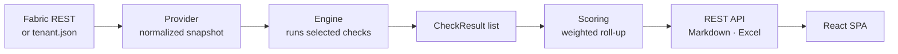

# Documentation

A rule-based platform that audits **Microsoft Fabric** workspaces against the
Well-Architected pillars, read-only and fully deterministic — every check is a
fixed rule with a fixed threshold and pre-written remediation, so the same input
always produces the same score.

---

## Start here

| # | Document | Read it when you want to… |
|---|----------|---------------------------|
| 1 | **[getting-started.md](getting-started.md)** | **Set the project up and run it.** Prerequisites, install, both servers, first audit, troubleshooting |
| 2 | [architecture.md](architecture.md) | Understand the layers, the runtime flow, and the contracts everything hangs off |
| 3 | [checks.md](checks.md) | See every check, or add a new one |
| 4 | [scoring.md](scoring.md) | Understand how 0–3 scores roll up into pillar percentages |
| 5 | [api.md](api.md) | Call the API from a client, a script, or a test |
| 6 | [migration.md](migration.md) | See what changed from the Flask original, what was reused, and why |
| 7 | [scalability.md](scalability.md) | Plan for scale, Azure deployment, and the future AI layer |

New to the codebase? **getting-started.md** then **architecture.md**. The rest
assumes their vocabulary.

---

## The system in one paragraph

A *project* spans one or more Fabric *workspaces*, each tagged with a **layer**
(Data Prep, Data Storage, Data Logs, Data Operations, Reporting / Semantic). A
**provider** reads each workspace into a normalized snapshot — from the live
Fabric REST API or an offline fixture. A registry of small pure functions, the
**checks**, each inspect that snapshot and return a verdict scored 0–3. Those
roll up into an overall score, a per-pillar scorecard, a per-workspace breakdown,
and a **pillar × layer matrix**, then render as JSON for the React app and as
Markdown and Excel files.

---

## Stack

| Layer | Technology |
|-------|-----------|
| Frontend | React 18, TypeScript, Vite, Tailwind, Axios |
| API | FastAPI, Pydantic v2, uvicorn |
| Domain | Pure Python — no framework dependency |
| Auth | MSAL, read-only delegated Entra scopes |
| Reports | openpyxl (Excel), Markdown |
| Tests | pytest + FastAPI TestClient — 52, fully offline |

Three adapters sit over one service layer: the **REST API**, the **CLI**, and an
**MCP server**. They cannot disagree, because there is one implementation with
three front doors.

---

## Current coverage

| Pillar | Checks |
|--------|-------:|
| Operational Excellence | 8 |
| Security | 5 |
| Reliability | 4 |
| Cost Optimization | 2 |
| Performance Efficiency | **0** — not yet automated |

Automated today: workspace-level and Data Pipeline checks. Notebooks,
Lakehouse/Delta, semantic models, and Eventhouse are not yet automated — the
`Scope` members exist so adding them requires no engine change.

**There is no AI in this release.** `ai/` contains structure and intent only.

---

## Design documents

The original specification, the 13-area deep-dive checklist, and the scoring
rubric live in `Local/` at the repository root, which is **excluded from git**
because the checklist contains findings from a real engagement. Several source
files cite them by name; those references will not resolve in a fresh clone.

Moving a scrubbed copy under `docs/design/` is an open task.
