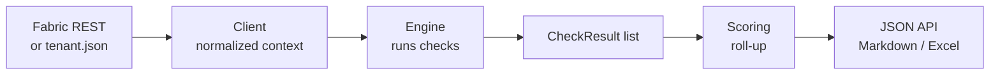

# AuditFAST Core — Documentation

**AuditFAST Core** signs in to Microsoft Fabric **read-only**, runs deterministic
best-practice checks across the workspaces that make up a project, scores them
against the Well-Architected pillars, and produces a rated report.

Every check is a fixed rule with a fixed threshold and a pre-written
recommendation. **There is no AI in this release** — the same input always
produces the same score.

---

## Start here

| # | Document | Read it when you want to… |
|---|----------|---------------------------|
| 1 | [architecture.md](architecture.md) | Understand the layers, the runtime flow, and the two data contracts everything hangs off |
| 2 | [checks.md](checks.md) | See every check that exists, or add a new one |
| 3 | [scoring.md](scoring.md) | Understand how 0–3 scores roll up into pillar percentages and ratings |
| 4 | [api.md](api.md) | Call the JSON API from a front end, a script, or a test |
| 5 | [development.md](development.md) | Set the project up, run it, test it, or configure a new engagement |

If you are new to the codebase, read **architecture.md** first — the rest assumes
its vocabulary.

---

## The one-paragraph version

A *project* spans one or more Fabric *workspaces*, each tagged with a **layer
role** (Data Prep, Data Storage, Data Logs, Data Operations, Reporting /
Semantic). A client adapter reads each workspace into a normalized
**workspace-context** dictionary — from the live Fabric REST API, or from an
offline JSON fixture. A registry of small pure functions (the **checks**) each
inspect that context and return a **CheckResult** scored 0–3. Those results are
aggregated into an overall score, a per-pillar scorecard, and a per-workspace
breakdown, then rendered as JSON for the browser and as Markdown / Excel files.

---

## Current status

**Phase 1.** Automated: workspace-level checks and Data Pipeline checks.
Everything else — notebooks, Delta/Lakehouse internals, semantic models,
reports — is Phase 2, currently covered by the manual Excel checklist.

| Pillar | Automated checks today |
|--------|------------------------|
| Operational Excellence | 8 |
| Security | 5 |
| Reliability | 4 |
| Cost Optimization | 2 |
| Performance Efficiency | **0** — Phase 2 |

See [checks.md](checks.md) for the full catalog.

---

## Related documents outside this folder

The original design specification, the 13-Area deep-dive checklist, and the
scoring rubric live in `Local/` at the repository root, which is **excluded from
git**. Several source files reference them by name — for example
[`scoring.py`](../backend/auditfast/core/scoring.py) cites `01-scoring-rubric.md`
and the check modules cite "Section 6.1 / 6.2 of the design". Those references do
not resolve in a fresh clone.

Moving them under `docs/design/` is tracked as an open task; they need a review
for client-identifying content first, because the checklist contains findings
from a real engagement.
