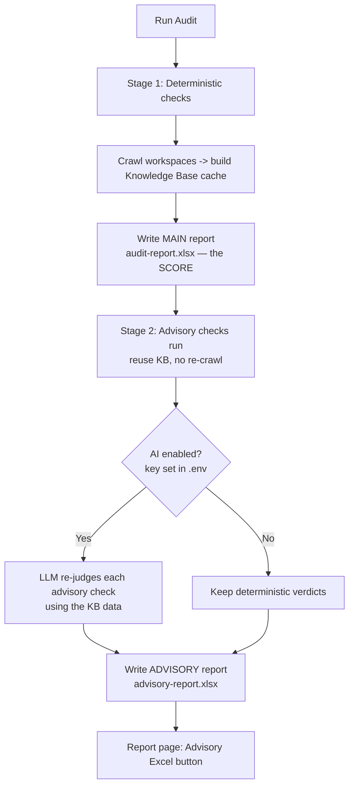

# AI-Assisted Advisory Report

> A second, separate report for the **non-deterministic** checks — the ones a
> fixed rule can only guess at. An optional LLM re-judges them using the real
> workspace data. **The deterministic audit score is never affected.**

---

## 1. Why this exists

Checks fall into two kinds:

- **Deterministic** — e.g. *"Does the notebook contain `OPTIMIZE`?"* A regex
  answers this the same way every time. These produce the **score**.
- **Advisory (non-deterministic)** — e.g. *"Is this notebook well-structured?"*
  or *"Are aggregations consistent?"* A regex can only guess and often produces
  false positives/negatives.

The advisory checks are **pulled out of the score** and put in their own report.
For that report, an LLM reads the actual evidence and gives a smarter verdict —
which is exactly what a fixed rule cannot do.

Three guarantees:

1. **The score never changes** — AI only rewrites the advisory report.
2. **AI is optional** — no key or a gateway error → the deterministic verdict is
   kept. Nothing breaks.
3. **Grounded, not invented** — the model only sees real Knowledge Base data and
   is told to answer *low confidence* rather than make facts up.

---

## 2. New files

| File | Responsibility |
|------|----------------|
| `backend/src/auditfast/core/advisory.py` | The **list of advisory check refs** + `is_advisory(ref)`. Single source of truth for which checks are advisory. |
| `backend/src/auditfast/ai/advisory.py` | The **AI evaluator**: builds a prompt per advisory finding, calls the model, parses the JSON verdict, falls back to the original on any failure. |
| `backend/tests/test_advisory.py` | Tests the partition + separate downloadable report. |
| `backend/tests/test_advisory_ai.py` | Tests the AI evaluator (off = no-op, on = rewrite, bad JSON = fallback, score→status). |

### Files edited (not new)

| File | Change |
|------|--------|
| `backend/src/auditfast/ai/orchestrator/__init__.py` | Added an **OpenAI-compatible provider** (works with MAQ AI, GitHub Models, OpenAI.com, Ollama) alongside Azure OpenAI. |
| `backend/src/auditfast/config/settings.py` | New settings: `ai_provider`, `openai_base_url`, `openai_api_key`, `openai_model`. |
| `backend/src/auditfast/services/audit_service.py` | The **two-stage flow**: split registries, run deterministic (Stage 1), run + AI-judge advisory (Stage 2), write the advisory report. |
| `backend/src/auditfast/core/models.py` | Marks each result with an `advisory` flag. |
| `backend/src/auditfast/schemas/audit.py` | `AdvisorySection` in the API response. |
| `backend/src/auditfast/api/v1/reports.py` | `advisory-markdown` / `advisory-excel` download kinds. |
| `frontend/src/pages/ReportPage.tsx` | "Advisory (Excel)" download button. |
| `frontend/src/services/auditService.ts`, `frontend/src/types/api.ts` | Frontend types + URL for the advisory report. |
| `backend/tests/conftest.py`, `backend/tests/test_api.py` | Split expected counts (deterministic vs advisory); autouse fixture forces AI off in tests for hermeticity. |

---

## 3. The flow



**Two stages, one audit job:**

1. **Stage 1 — the score.** Deterministic checks run and crawl every workspace
   once. That crawl fills the **Knowledge Base (KB)** — a cached snapshot of
   notebooks, tables, semantic models, etc. Produces `audit-report.xlsx`.
   **No AI here; the score is reproducible.**
2. **Stage 2 — advisory.** The advisory checks run against the **already-cached
   KB** (no second crawl). If AI is on, the LLM re-judges each; if off, the plain
   deterministic verdicts are used. Results go into a **separate**
   `advisory-report.xlsx`.

---

## 4. How the AI step works (step by step)

For each advisory finding, `ai/advisory.py`:

1. Builds a small prompt:
   > *"Here is the check. Here is the deterministic guess (which may be wrong).
   > Here is the real workspace evidence. Re-judge it and reply with JSON only."*
2. Includes the relevant **KB slice** as evidence:
   - notebook scope → the notebook's code,
   - pipeline scope → the pipeline JSON,
   - workspace scope → a compact summary (tables, semantic models, SQL
     views/routines, item types).
   The evidence is size-capped (`_MAX_EVIDENCE_CHARS = 6000`).
3. Calls the **orchestrator**, which sends it to the configured gateway and gets
   back JSON: `{"score": 0-3, "evidence": "...", "recommendation": "...", "confidence": "high|medium|low"}`.
4. Rewrites the verdict — `source="advisory-ai"`, status derived from the score,
   evidence prefixed with `[AI - <confidence> confidence] ...`.
5. **Caches** identical `(check, workspace, object, evidence)` inputs so repeated
   items cost one call and stay stable within a run.
6. On **any** failure (AI off, gateway error, bad/oversized/out-of-range JSON)
   the original deterministic verdict is returned unchanged.

> **Reasoning-model note.** Some gateway models (e.g. `qwen-3.8-27b`) spend
> completion tokens "thinking" before the answer. The advisory call uses
> `max_tokens=1500` so the reasoning tokens plus the JSON answer both fit.

---

## 5. Configuration

Set in `backend/.env` (git-ignored — the key is never committed):

```env
AUDITFAST_AI_ENABLED=true
AUDITFAST_AI_PROVIDER=openai
AUDITFAST_OPENAI_BASE_URL=https://llm.maqsoftware.net/v1
AUDITFAST_OPENAI_MODEL=qwen-3.8-27b
AUDITFAST_OPENAI_API_KEY=sk-...
```

- **Restart the backend** after editing `.env` — settings are read once at
  startup (no hot-reload).
- With the key **blank**, AI stays OFF and the advisory report uses the
  deterministic verdicts. Nothing calls out.
- The provider is any OpenAI-compatible gateway — swap `BASE_URL` / `MODEL` to
  use GitHub Models, OpenAI.com, Ollama, etc.
- Available models for a key: `GET {BASE_URL}/models`.

---

## 6. Getting the Advisory report

- **UI** — the **"Advisory (Excel)"** button on the Report page (shown only when
  advisory results exist).
- **API** — `GET /api/v1/reports/{audit_id}/download/advisory-excel`
  (also `advisory-markdown`).
- **Disk** — `backend/output/advisory-report.xlsx`.

**Confirm the AI ran:** open the Excel — AI-graded rows have evidence starting
with `[AI - … confidence]`. Plain deterministic evidence means AI fell back or
was off for that row.

---

## 7. Caveats in this environment

- `pyodbc` is not installed, so the SQL-endpoint data some advisory checks rely
  on is empty — those checks get thin KB context. Notebook / table /
  semantic-model based advisory checks have full context.
- The advisory stage runs **after** the deterministic report, so the main score
  shows first; the advisory report appears once Stage 2 finishes.
