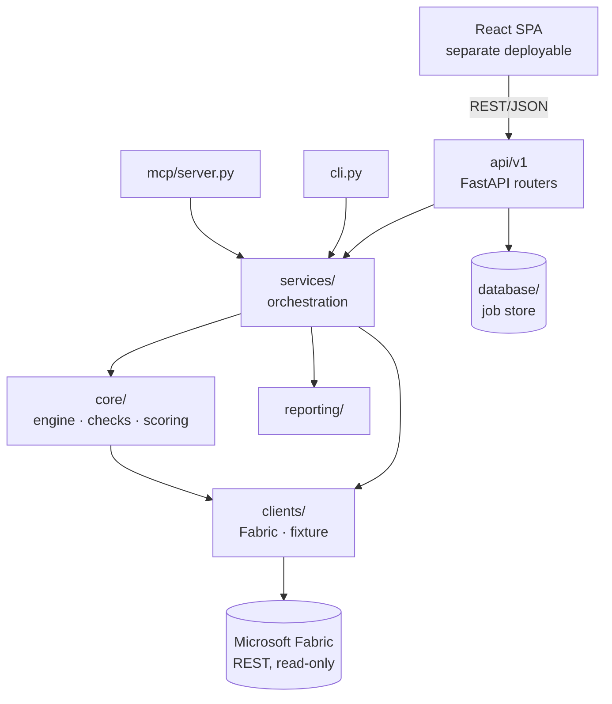
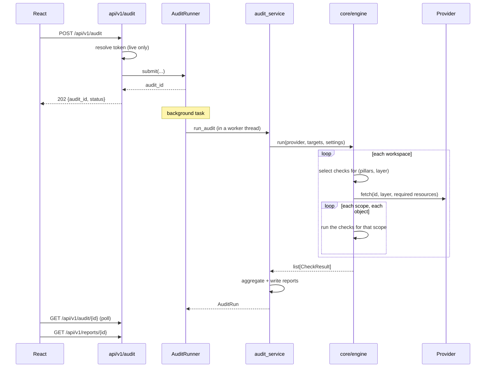

# Architecture

How the system is organised, what depends on what, and exactly what happens when
an audit runs.

---

## 1. Vocabulary

Five terms carry the whole domain.

| Term | Meaning |
|------|---------|
| **Project** | One engagement. Spans **one or more** Fabric workspaces. Defined by a YAML file. |
| **Workspace** | A Fabric workspace, audited as a unit. |
| **Layer** | What a workspace is *for*: `Data Prep`, `Data Storage`, `Data Logs`, `Data Operations`, `Reporting / Semantic`, `Mixed`. Your "inner pillars". |
| **Pillar** | A Well-Architected pillar: Reliability, Security, Cost Optimization, Operational Excellence, Performance Efficiency. Plus `Foundation` — cross-cutting, informational, never scored. |
| **Scope** | The kind of object a check inspects: `workspace`, `pipeline`, and (reserved) `notebook`, `lakehouse`, `semantic_model`, `report`, `eventhouse`. |

Every check also carries a **`ref`** — a dotted string like `2.4.1`. It points at
a line item in the 13-area deep-dive checklist and is the key used to look up
remediation text. It is the traceability spine between the automated tool and the
manual audit instrument.

All of these are enums in [`core/enums.py`](../backend/src/auditfast/core/enums.py),
defined exactly once. Previously pillars were bare strings and layer roles were
re-declared in three places.

---

## 2. Layers



**The dependency rule: arrows point inward. `core/` imports nothing outward.**

`core/` is pure domain logic — no FastAPI, no `requests`, no database.
`services/` orchestrates but imports no web framework. Verify it:

```powershell
# Returns nothing — the audit engine has no web dependency.
Select-String -Path backend/src/auditfast/core/*.py,backend/src/auditfast/services/*.py -Pattern "fastapi|flask"
```

That property is why the REST API, the CLI, and the MCP server produce identical
results: one implementation, three front doors.

---

## 3. Module map

| Path | Responsibility |
|------|----------------|
| [`core/enums.py`](../backend/src/auditfast/core/enums.py) | Pillar, Layer, Scope, Resource, Status, Severity |
| [`core/models.py`](../backend/src/auditfast/core/models.py) | `WorkspaceContext`, `CheckContext`, `CheckSpec`, `CheckResult` |
| [`core/scoring.py`](../backend/src/auditfast/core/scoring.py) | Bands, ratings, weighted roll-up, pillar×layer matrix |
| [`core/engine.py`](../backend/src/auditfast/core/engine.py) | Generic scope-driven dispatch |
| [`core/checks/registry.py`](../backend/src/auditfast/core/checks/registry.py) | The single registry and the `@check` decorator |
| [`core/checks/helpers.py`](../backend/src/auditfast/core/checks/helpers.py) | `Verdict` and the builders |
| [`core/checks/workspace/`](../backend/src/auditfast/core/checks/workspace/) | 12 workspace checks, one module per pillar |
| [`core/checks/pipeline/`](../backend/src/auditfast/core/checks/pipeline/) | 8 pipeline checks, one module per pillar |
| [`clients/`](../backend/src/auditfast/clients/) | `LiveFabricProvider` (the only shipped provider) and the `Provider` protocol |
| [`services/audit_service.py`](../backend/src/auditfast/services/audit_service.py) | The one audit path |
| [`services/audit_runner.py`](../backend/src/auditfast/services/audit_runner.py) | Background execution, concurrency limits |
| [`services/catalog_service.py`](../backend/src/auditfast/services/catalog_service.py) | Catalog questions; no I/O |
| [`services/project.py`](../backend/src/auditfast/services/project.py) | Project YAML → `ProjectConfig` |
| [`services/auth_service.py`](../backend/src/auditfast/services/auth_service.py) | Read-only Entra sign-in |
| [`api/v1/`](../backend/src/auditfast/api/v1/) | 8 routers, 24 endpoints |
| [`api/deps.py`](../backend/src/auditfast/api/deps.py) | Dependency injection |
| [`api/errors.py`](../backend/src/auditfast/api/errors.py) | Exception → HTTP mapping |
| [`schemas/`](../backend/src/auditfast/schemas/) | Pydantic request/response models |
| [`config/`](../backend/src/auditfast/config/) | Settings, structured logging |
| [`database/`](../backend/src/auditfast/database/) | Job model + repository pattern |
| [`ai/`](../backend/src/auditfast/ai/) | Scaffolding only — nothing implemented |
| [`mcp/server.py`](../backend/src/auditfast/mcp/server.py) | MCP tools over the same services |

---

## 4. What happens during an audit



**Why fire-and-poll:** a tenant-wide audit issues many sequential Fabric calls
and can take minutes. A synchronous endpoint would tie up a worker and time out
at any gateway in front of it.

**Why a worker thread:** `run_audit` is synchronous and I/O-bound. Calling it
directly from an async handler would block the event loop and stall every other
request. `AuditRunner` dispatches it via `asyncio.to_thread` behind a semaphore
that caps concurrent audits.

---

## 5. The engine is generic

The engine knows nothing about any specific check, pillar, or artifact type. It
dispatches purely on `Scope`:

```python
for workspace_id, layer in targets:
    specs = registry.select(pillars=..., layer=layer)
    resources = registry.required_resources(specs)   # only fetch what's needed
    workspace = provider.fetch(workspace_id, layer, resources)

    for scope in registry.scopes(specs):
        for obj_name, obj in workspace.objects(scope):
            for spec in specs_for(scope):
                emit(spec.fn(CheckContext(workspace, settings, obj_name, obj)))
```

Adding a new artifact type — lakehouses, semantic models, notebooks — means:

1. add a `Scope` member,
2. teach a provider to yield those objects,
3. write checks tagged with that scope.

[`engine.py`](../backend/src/auditfast/core/engine.py) does not change.

---

## 6. Contract 1 — the workspace context

The most important interface in the system. Every provider emits this, which is
why checks run unmodified against live data or an offline fixture.

```python
@dataclass
class WorkspaceContext:
    id: str
    display_name: str
    layer: Layer
    capacity_id: str | None
    git_connected: bool
    deployment_pipeline: bool
    role_assignments: list[RoleAssignment]
    items: list[Item]
    pipelines: dict[str, dict]      # name -> parsed definition
    unavailable: set[Resource]      # what could NOT be read
```

`unavailable` is what separates *"we could not determine this"* from *"this is
not configured"*. A check whose data landed there reports **N/A** instead of
failing — a network error must not look like a misconfiguration.

**Adding a data source** means writing one method:

```python
def fetch(self, workspace_id, layer, resources) -> WorkspaceContext: ...
```

Nothing in `core/` changes.

### Resource-driven fetching

Checks declare what they need via `requires=`. The engine unions the
requirements of the *selected* checks and passes that set to the provider, so a
run that scores no pipeline checks never pays for `getDefinition` — one call per
pipeline, the most expensive operation in a live audit.

| Resource | Live cost |
|----------|-----------|
| `WORKSPACE` | 1 call, always made |
| `ITEMS` | 1 call |
| `ROLE_ASSIGNMENTS` | 1 call |
| `GIT` | 1 call |
| `PIPELINE_DEFINITIONS` | **one call per pipeline** |

---

## 7. Contract 2 — checks carry metadata

A check declares everything about itself at registration:

```python
@check(
    id="PL-RETRY", ref="2.4.1",
    title="Retry policy configured on activities",
    pillar=Pillar.RELIABILITY, scope=Scope.PIPELINE,
    severity=Severity.HIGH, layers=PIPELINE_LAYERS,
    requires=[Resource.PIPELINE_DEFINITIONS],
)
def retry_policy(ctx: CheckContext) -> Verdict:
    """Activities that call external systems retry before failing."""
    acts = activities(ctx.obj)
    with_retry = [a for a in acts if (a.get("policy") or {}).get("retry", 0) >= 1]
    return covered(len(with_retry), len(acts),
                   f"{len(with_retry)} of {len(acts)} activities have a retry policy")
```

The check returns a small `Verdict` — a score plus evidence. The engine combines
it with the registered `CheckSpec` to build the full `CheckResult`. That split is
why a check body is three lines instead of ten: id, ref, title, pillar, severity,
weight, scope, workspace name, and object name all come from elsewhere.

Because metadata exists before execution, the system can:

- list the catalog without running an audit (`GET /catalog/checks`),
- run one check by id (`POST /audit/check`),
- filter *before* running, so deselecting a pillar skips its Fabric calls.

See [checks.md](checks.md) for the full catalog and how to add one.

---

## 8. Registration is an import side effect

The `@check` decorator registers at import time. Those imports are triggered by
[`core/checks/__init__.py`](../backend/src/auditfast/core/checks/__init__.py),
which imports every check module purely for the side effect.

> **Gotcha:** a new check module not imported there registers nothing, raises
> nothing, and its checks silently never run. `registered_modules()` exists so a
> test can assert the list has not drifted, and `/api/v1/health` reports
> `checks_registered` so an empty catalog is visible rather than silent.

---

## 9. Authentication

Read-only throughout. Three ways in, all yielding a delegated bearer token:

| Flow | Used by |
|------|---------|
| Interactive browser sign-in | Web UI, primary |
| Existing `az login` | Web UI, no app registration needed |
| Device code | CLI / headless |

MSAL runs on a background thread; the caller receives a session id and polls.
**The token never leaves the server** — the browser holds only an opaque session
id, so a compromised browser cannot yield a Fabric access token.

> **Known limitation:** sessions live in a process-local dict, so sign-in does
> not survive a restart and is not shared across replicas. See
> [scalability.md](scalability.md#session-storage).

---

## 10. Frontend

React 18 + TypeScript + Vite + Tailwind + Axios, a **completely separate
deployable**. The API returns JSON only and renders no HTML.

| Path | Role |
|------|------|
| `src/services/` | The only modules that call the API; one Axios instance |
| `src/types/api.ts` | The API contract, mirrored from the Pydantic schemas |
| `src/hooks/useAsync.ts` | Shared async state: data, loading, error, reload |
| `src/context/AuditContext.tsx` | Mode, sign-in session, most recent audit |
| `src/pages/` | Dashboard, Run audit, Report, Catalog, History, Sign in |
| `src/components/` | `PillarMatrix`, `FindingsTable`, shared UI primitives |
| `src/utils/format.ts` | Rating bands, percentage and duration formatting |

In development Vite proxies `/api` to the backend, so the browser makes
same-origin requests and no CORS is involved. In production the app is built to
static files and points at the API origin via `VITE_API_BASE_URL`.

---

## 11. Cross-cutting concerns

| Concern | Where | Note |
|---------|-------|------|
| **Settings** | `config/settings.py` | pydantic-settings, `AUDITFAST_` prefix |
| **Logging** | `config/logging.py` | Structured JSON when hosted; correlation id on every record |
| **Correlation ids** | `api/middleware.py` | Generated or honoured from the request, echoed in the response |
| **Errors** | `api/errors.py` | Every failure returns the same JSON shape with a correlation id |
| **Validation** | `schemas/` | Pydantic; invalid requests fail before reaching a service |
| **Persistence** | `database/repositories/` | Protocol + in-memory implementation |

Internal exception messages are never returned to clients — they can carry
workspace ids and file paths. The client gets a correlation id; the detail goes
to the log.

---

## 12. Known limitations

Honest list, with pointers.

| Limitation | Impact |
|------------|--------|
| Job store is in-memory | History dies with the process; not shared across replicas |
| Auth sessions are process-local | Breaks under multi-worker or multi-replica deployment |
| Reports written to a fixed filename | Concurrent audits overwrite each other's files |
| All check weights are 1.0 | Roll-up is effectively unweighted; the mechanism exists but is untuned |
| No AI | Only `ai/` scaffolding; deliberate |
| Performance Efficiency has 0 checks | The pillar reports "not assessed" |

All are addressed in [scalability.md](scalability.md).
