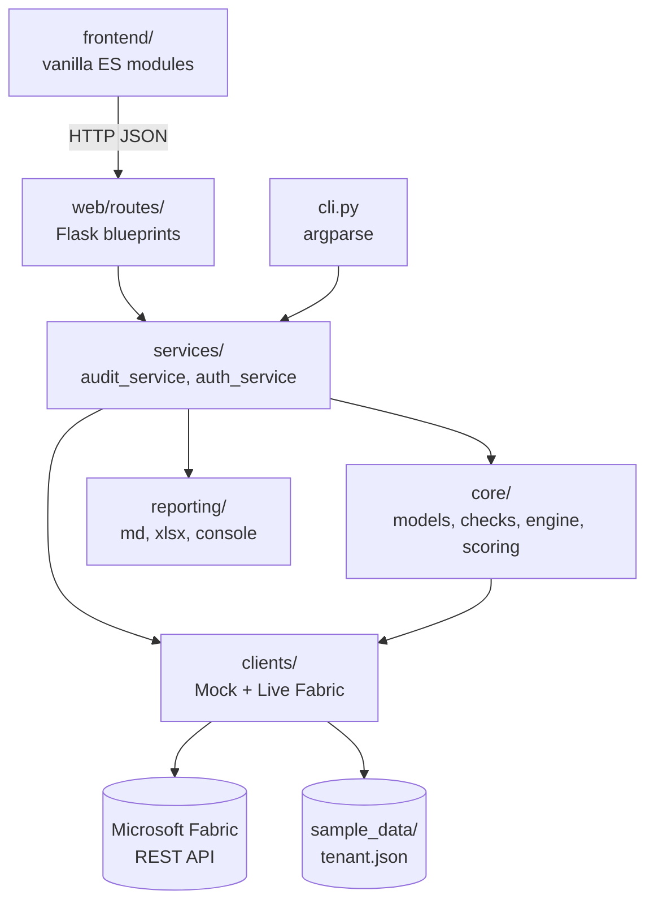
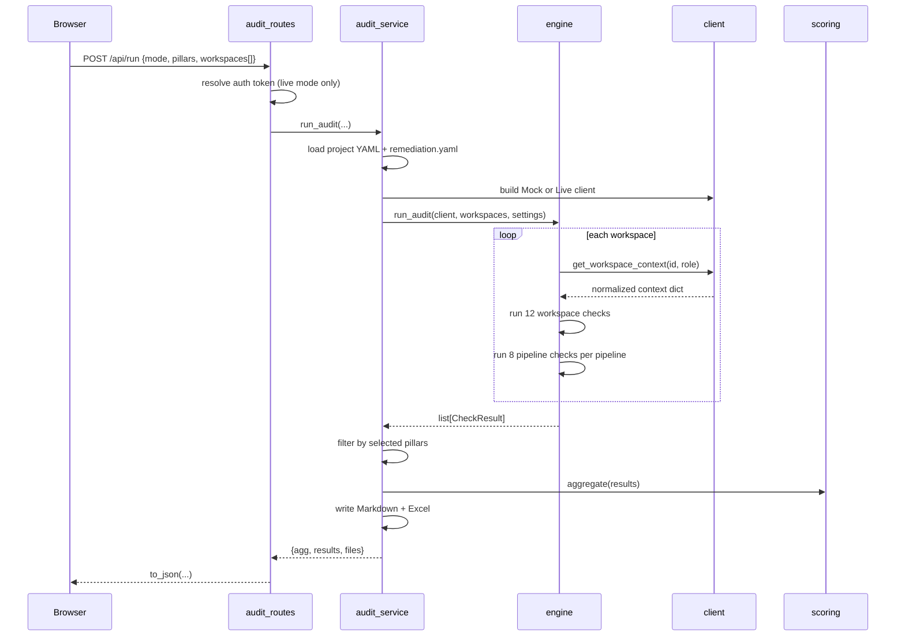

# Architecture

How the code is organized, what depends on what, and exactly what happens when an
audit runs.

---

## 1. Vocabulary

Four terms carry the whole domain. Get these right and the code reads easily.

| Term | Meaning |
|------|---------|
| **Project** | One engagement. Spans **one or more** Fabric workspaces. Defined by a YAML file — see [development.md](development.md#project-configuration). |
| **Workspace** | A Fabric workspace. Audited as a whole unit in Phase 1. |
| **Layer role** | What a workspace is *for*: `Data Prep`, `Data Storage`, `Data Logs`, `Data Operations`, `Reporting / Semantic`, or `Mixed`. A project's layers usually live in separate workspaces. |
| **Pillar** | A Well-Architected pillar: Reliability, Security, Cost Optimization, Operational Excellence, Performance Efficiency. Plus `Foundation`, a cross-cutting bucket for informational results that are never scored. |

Every check also carries a **`ref`** — a dotted string like `2.4.1` or `6.1.2`.
This is not decorative: it points at a specific line item in the 13-Area
deep-dive checklist, and it is the key used to look up remediation text in
[`remediation.yaml`](../backend/config/remediation.yaml). It is the traceability
spine between the automated tool and the manual audit instrument.

> **Naming note.** The pillar constants live as plain strings in
> [`core/models.py`](../backend/auditfast/core/models.py), and the layer roles are
> defined independently in three places: `EXPECTED_TYPES` in
> [`workspace_checks.py`](../backend/auditfast/core/checks/workspace_checks.py),
> `PIPELINE_ROLES` in [`engine.py`](../backend/auditfast/core/engine.py), and the
> `ROLES` array in [`frontend/js/core/state.js`](../frontend/js/core/state.js).
> They must be kept in sync by hand today.

---

## 2. Layers



**The dependency rule: arrows point inward, and `core/` imports nothing outward.**

`core/` is pure domain logic — no Flask, no `requests`, no file I/O beyond what
the checks are handed. `services/` orchestrates but imports no web framework
(verify with `grep -r flask backend/auditfast/services/` — it returns nothing).

That single property is what makes the CLI, the Flask API, the tests, and any
future adapter produce identical numbers, because they all enter through the same
service functions.

---

## 3. Module map

| Path | Responsibility |
|------|----------------|
| [`core/models.py`](../backend/auditfast/core/models.py) | `CheckResult` dataclass, `Status` / `Severity` enums, pillar constants |
| [`core/scoring.py`](../backend/auditfast/core/scoring.py) | Coverage → 0–3 band, rating bands, `aggregate()` roll-up |
| [`core/engine.py`](../backend/auditfast/core/engine.py) | Iterates workspaces, invokes every registered check, handles unreadable workspaces |
| [`core/checks/base.py`](../backend/auditfast/core/checks/base.py) | The two registries, the `@workspace_check` / `@pipeline_check` decorators, and four result builders |
| [`core/checks/workspace_checks.py`](../backend/auditfast/core/checks/workspace_checks.py) | 12 workspace-level checks |
| [`core/checks/pipeline_checks.py`](../backend/auditfast/core/checks/pipeline_checks.py) | 8 per-pipeline checks |
| [`clients/fabric_client.py`](../backend/auditfast/clients/fabric_client.py) | `MockFabricClient` + `LiveFabricClient`, both emitting the same context shape |
| [`services/audit_service.py`](../backend/auditfast/services/audit_service.py) | Load project → build client → run → aggregate → write reports → serialize |
| [`services/auth_service.py`](../backend/auditfast/services/auth_service.py) | Read-only OAuth2 sign-in; in-memory session store |
| [`security/device_flow.py`](../backend/auditfast/security/device_flow.py) | MSAL device-code flow for the CLI |
| [`web/__init__.py`](../backend/auditfast/web/__init__.py) | `create_app()` Flask factory |
| [`web/routes/`](../backend/auditfast/web/routes/) | Five thin blueprints — see [api.md](api.md) |
| [`reporting/`](../backend/auditfast/reporting/) | Markdown, Excel (3 sheets), console renderers |
| [`cli.py`](../backend/auditfast/cli.py) | `auditfast run` and `auditfast serve` |

Entry points: [`__main__.py`](../backend/auditfast/__main__.py) (`python -m auditfast`),
[`run.py`](../backend/run.py) (no `-m` needed), [`wsgi.py`](../backend/wsgi.py)
(gunicorn / waitress).

---

## 4. What happens during a run

Tracing `POST /api/run` end to end.



Step by step:

1. **Parse** — [`audit_routes.py:15-27`](../backend/auditfast/web/routes/audit_routes.py#L15-L27). The UI sends `workspaces` as `[{id, role, name}]`; older callers may send bare id strings, and both are accepted. In live mode the `auth_session` is exchanged for a token, or the request fails with 400.
2. **Load config** — [`audit_service.py:94-96`](../backend/auditfast/services/audit_service.py#L94-L96). Reads the project YAML, then loads `remediation.yaml` into a module-level dict via `set_remediation()`. *This is global mutable state* — the last caller wins, which matters if you ever run two projects concurrently in one process.
3. **Build a client** — `MockFabricClient` (reads a JSON fixture) or `LiveFabricClient` (Fabric REST with a bearer token).
4. **Run the engine** — [`engine.py:27-62`](../backend/auditfast/core/engine.py#L27-L62). For each workspace it fetches the context, runs every workspace check, then — only if the layer role is in `PIPELINE_ROLES` — runs every pipeline check against every pipeline.
5. **Filter by pillar** — [`audit_service.py:109-111`](../backend/auditfast/services/audit_service.py#L109-L111). Note this happens **after** all checks have run, so in live mode you pay for every API call even for deselected pillars. Unscored results (INFO, access errors) always survive the filter.
6. **Aggregate** — see [scoring.md](scoring.md).
7. **Write reports** — Markdown and Excel into `OUT_DIR`, retrievable via `/api/download/<kind>`.
8. **Serialize** — `to_json()` splits `WS-ACCESS` results out of `results` into a separate `errors` array so unreadable workspaces surface as warnings rather than as ordinary failing checks.

### Unreadable workspaces

A workspace that is missing, forbidden, or unreachable does **not** silently score
zero. The client raises `WorkspaceAccessError`, the engine converts it into a
non-scored `WS-ACCESS` result ([`engine.py:13-24`](../backend/auditfast/core/engine.py#L13-L24)),
and the UI renders it in a warning banner. `WorkspaceAccessError._friendly()`
maps HTTP 401/403/404 to plain-English guidance.

This distinction is deliberate and worth preserving: *"we could not look"* is not
the same finding as *"we looked and it was misconfigured."*

---

## 5. Contract 1 — the workspace context

The most important interface in the system. Both clients emit exactly this shape,
which is why every check runs unmodified against offline fixtures.

```python
{
  "id": "ws-prep-01",
  "displayName": "Sales-Prod-DataPrep",
  "role": "Data Prep",                    # layer role, injected by the caller
  "capacityId": "cap-123" | None,
  "gitConnected": True | False,
  "deploymentPipeline": True | False,
  "roleAssignments": [
      {"principalType": "User"|"Group"|"Guest", "displayName": str, "role": "Admin"|...}
  ],
  "items": [
      {"id": str, "type": "Lakehouse"|"DataPipeline"|..., "displayName": str,
       "sensitivityLabel": str | None, "lastRunUtc": "2026-01-01T00:00:00Z" | None}
  ],
  "pipelines": {"<pipeline name>": <ADF/Fabric pipeline definition dict>}
}
```

Defined in [`fabric_client.py:11-18`](../backend/auditfast/clients/fabric_client.py#L11-L18).
It is a plain `dict`, so it is untyped and unvalidated — checks access it with
`.get()` and defensive defaults throughout.

**Adding a new data source** means writing a class with one method,
`get_workspace_context(ws_id, role) -> dict`, that returns this shape. Nothing in
`core/` needs to change.

### How the live client fills it

`LiveFabricClient.get_workspace_context()` reads the workspace first and checks
the HTTP status *before* anything else, so a 403 fails loudly rather than
producing an empty context. It then issues:

| Call | Fills |
|------|-------|
| `GET /workspaces/{id}` | `displayName`, `capacityId`, `deploymentPipeline` |
| `GET /workspaces/{id}/items` | `items` |
| `GET /workspaces/{id}/roleAssignments` | `roleAssignments` |
| `GET /workspaces/{id}/git/connection` | `gitConnected` |
| `POST /workspaces/{id}/items/{item}/getDefinition` | `pipelines` — one call **per pipeline** |

All calls are read-only (`getDefinition` is a POST but does not mutate).

> **Known issue.** `_get()` ([`fabric_client.py:99-106`](../backend/auditfast/clients/fabric_client.py#L99-L106))
> swallows every exception and returns `None`. A network blip is therefore
> indistinguishable from "the feature is not configured", and scores as a
> failure. `Status.NA` exists in the model but is never produced.

---

## 6. Contract 2 — CheckResult

Every check returns one of these (or a list of them). Defined in
[`core/models.py:45-64`](../backend/auditfast/core/models.py#L45-L64).

| Field | Notes |
|-------|-------|
| `check_id` | Stable code, e.g. `WS-GIT`, `PL-RETRY` |
| `ref` | Checklist reference — also the remediation lookup key |
| `title`, `pillar`, `evidence`, `recommendation` | Human-facing |
| `status` | `PASS` / `PARTIAL` / `FAIL` / `N/A` / `INFO` |
| `score` | `0`–`3`, or `None` for informational results |
| `coverage` | `0.0`–`1.0` for proportional checks, else `None` |
| `severity` | Forced to `Informational` when the check passes |
| `workspace`, `workspace_role`, `obj` | Where the finding is. `obj` is blank for workspace-level checks |
| `scored` | `False` excludes the result from all score maths |

`MAX_SCORE = 3` is a class attribute on the dataclass.

---

## 7. Check registration — an import side effect

This mechanism is load-bearing and easy to trip over.

The decorators in [`base.py:29-36`](../backend/auditfast/core/checks/base.py#L29-L36)
append the function to a module-level list at **import time**:

```python
WORKSPACE_CHECKS: list = []
PIPELINE_CHECKS: list = []

def workspace_check(fn):
    WORKSPACE_CHECKS.append(fn)
    return fn
```

Those imports are triggered by
[`checks/__init__.py`](../backend/auditfast/core/checks/__init__.py), which imports
both check modules purely for the side effect. Importing `engine` transitively
pulls in the package, so by the time anything calls `run_audit()` all 20 checks
are registered.

> **Gotcha:** a new check module that is not imported in `checks/__init__.py` will
> register nothing and fail silently — no error, the checks just never run. See
> [checks.md](checks.md#adding-a-check).

Because registration stores only the bare function, a check's pillar, ref and
severity are hardcoded inside the function body and do not exist until the check
has already executed. That is why pillar filtering has to happen after the run,
and why there is currently no way to list the check catalog without running an
audit.

---

## 8. Authentication

Read-only throughout. Three ways in, all producing a delegated bearer token:

| Flow | Where | Used by |
|------|-------|---------|
| Interactive browser sign-in | [`auth_service.login_interactive()`](../backend/auditfast/services/auth_service.py) | Web UI, primary path |
| Existing `az login` session | `auth_service.login_azcli()` | Web UI, no app registration needed |
| Device code | `auth_service.start_device_flow()` and [`security/device_flow.py`](../backend/auditfast/security/device_flow.py) | CLI / headless |

Interactive and device-code flows run MSAL on a **background thread** and return
a session id immediately; the browser polls `/api/auth/poll` until the status
flips to `done`.

Tokens are held in `_SESSIONS`, a module-level dict
([`auth_service.py:29`](../backend/auditfast/services/auth_service.py#L29)). They
live only for the process lifetime and are never written to disk or logged.

Requested scopes default to `Workspace.Read.All` and `Item.Read.All`. When no
client id is configured the service falls back to Microsoft's first-party Azure
CLI public client so a user can sign in with just an email — some tenants block
this via Conditional Access, in which case a real app registration is required.

> **Known issue.** Because `_SESSIONS` is a process-local global, sign-in breaks
> under any multi-worker WSGI deployment: the poll can land on a different worker
> than the one holding the session. Fine for `serve`; not production-ready.

---

## 9. Front end

Vanilla ES modules, no build step, no framework. Flask serves
[`frontend/index.html`](../frontend/index.html) at `/` and the assets under
`/static`.

| File | Role |
|------|------|
| [`js/main.js`](../frontend/js/main.js) | Entry point: loads config, wires every DOM event |
| [`js/core/api.js`](../frontend/js/core/api.js) | The only module that calls `fetch` |
| [`js/core/state.js`](../frontend/js/core/state.js) | Single mutable `state` object, plus `ROLES` and pillar help text |
| [`js/core/utils.js`](../frontend/js/core/utils.js) | `esc`, `fmt`, `ratingOf`, `sevColor` |
| [`js/features/auth.js`](../frontend/js/features/auth.js) | Sign-in and the poll loop |
| [`js/features/workspaces.js`](../frontend/js/features/workspaces.js) | Workspace list, selection, role assignment |
| [`js/features/results.js`](../frontend/js/features/results.js) | Renders the scorecard, findings, and check table |
| [`js/ui/loading.js`](../frontend/js/ui/loading.js), [`js/ui/game.js`](../frontend/js/ui/game.js) | Loading overlay; optional mini-game (removable — delete the import in `main.js`) |

State is exported as one mutable object rather than as `let` bindings, because an
imported binding is read-only and could not be reassigned across modules.

`results.js` renders `by_pillar` keyed on the pillar list from `/api/config`, so
adding a pillar server-side flows through without a front-end change. Adding a
*layer* dimension would require a new render path.

---

## 10. Structural constraints to know before extending

Honest list of what will resist change, with pointers to the detail.

| Constraint | Impact |
|------------|--------|
| Checks carry no metadata until they run | Cannot list the catalog, cannot run one check by id, cannot filter before execution |
| One registry per object type, with a matching branch in the engine | Every new artifact type (lakehouse, semantic model, notebook) needs a new registry and an engine edit |
| Two different check signatures | `fn(ws, settings)` vs `fn(ws, name, definition, settings)`; each new type invents a third |
| Layer roles duplicated in three places | Must be edited in sync |
| Scoring is an unweighted mean | Diverges from the rubric — see [scoring.md](scoring.md#divergence-from-the-rubric-no-weights) |
| `set_remediation()` mutates module state | Not safe for concurrent multi-project runs |
| `_SESSIONS` is process-local | Breaks under multi-worker WSGI |
| No `pyproject.toml` | Tests need a `sys.path.insert` shim ([`test_smoke.py:5`](../backend/tests/test_smoke.py#L5)) |

None of these block Phase 1. All of them will be felt when the check library
grows past pipelines into the other four layers.
