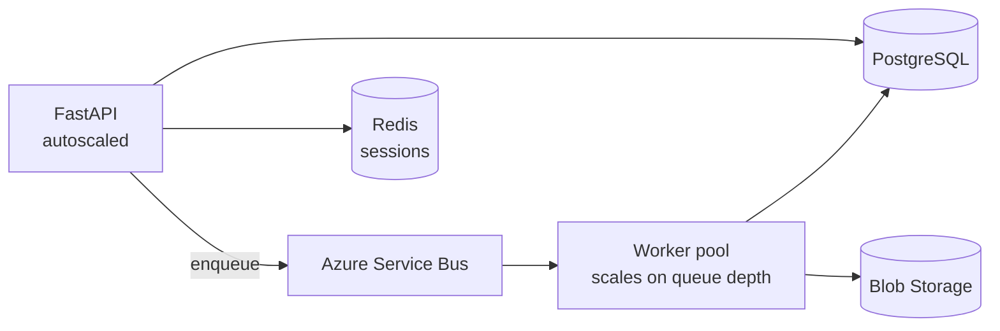

# Scalability, deployment, and the AI roadmap

What the current build supports, what it does **not**, and what to change for
each step up. Written against the stated target: 500+ organizations, thousands of
workspaces, concurrent and scheduled audits, and a later AI layer.

---

## 1. Honest current state

The architecture is designed for scale; the *deployment* is not there yet. Both
statements matter.

| Concern | Today | Blocks scale? |
|---------|-------|---------------|
| Audits run off the request path | Yes — fire-and-poll, background task | No |
| Event loop stays free | Yes — blocking work goes to a thread pool | No |
| Concurrency bounded | Yes — semaphore, 4 concurrent audits | No |
| Stateless API | Almost — see sessions and job store | **Yes** |
| Job store | In-memory dict | **Yes** — dies with the process, not shared |
| Auth sessions | Process-local dict | **Yes** — breaks on multi-worker/replica |
| Report files | Fixed filename on local disk | **Yes** — concurrent runs overwrite |
| Multi-tenancy | Header + repository filter, not enforced | **Yes** — no auth on the API itself |
| Scheduled audits | Not implemented | Yes, for the feature |
| Database | None | Yes, for history and scheduling |

**What this means practically:** run one replica today. Every blocker below is a
contained change, because the audit engine itself is already stateless and pure.

---

## 2. The three blockers, in order

### Session storage

`_SESSIONS` in [`auth_service.py`](../backend/src/auditfast/services/auth_service.py)
is a module-level dict. A poll can land on a different worker than the one
holding the session, so sign-in fails intermittently the moment you run more than
one worker.

**Fix:** move sessions to Redis (Azure Cache for Redis) behind a small
`SessionStore` protocol, mirroring the repository pattern already used for jobs.
The token still never reaches the browser.

```python
class SessionStore(Protocol):
    async def put(self, session_id: str, token: str, ttl_seconds: int) -> None: ...
    async def get(self, session_id: str) -> str | None: ...
    async def delete(self, session_id: str) -> None: ...
```

### Job store

[`InMemoryAuditJobRepository`](../backend/src/auditfast/database/repositories/memory.py)
already satisfies the `AuditJobRepository` protocol, and services depend only on
that protocol.

**Fix:** add `PostgresAuditJobRepository` and swap it in the lifespan. No
service, router, or test changes — that is the point of the pattern.

```
database/
  session.py                    # async engine + session factory
  models.py                     # SQLAlchemy tables alongside the dataclasses
  repositories/postgres.py      # the second implementation
  migrations/                   # alembic
```

Minimum schema: `organizations`, `projects`, `audit_jobs`, `check_results`,
`schedules`. Index `audit_jobs` on `(organization_id, submitted_at desc)` —
that is the history query.

### Report storage

Reports are written to a fixed filename in a local directory, so two concurrent
audits overwrite each other and `/reports/{id}/download` returns whichever ran
last regardless of the id.

**Fix:** write to Azure Blob Storage keyed by `audit_id`, and return a
short-lived SAS URL. This also makes the API pod stateless, which is a
prerequisite for autoscaling.

---

## 3. Scaling to 500+ organizations

### Move execution out of the API process

The in-process `AuditRunner` is the right shape but the wrong deployment for
scale: an API restart kills in-flight audits, and audit load competes with
request latency.



`AuditRunner.submit()` becomes "enqueue a message"; the worker calls the exact
same `audit_service.run_audit()`. Nothing in `core/` or `services/` changes —
this is why execution was kept behind a submit/poll interface from the start.

API pods then scale on request rate, workers on queue depth. They are different
curves: one audit generates minutes of work from a single request.

### Respect Fabric's rate limits before your own

At thousands of workspaces the binding constraint is Microsoft's throttling, not
your CPU. A live audit issues, per workspace: 1 workspace call, 1 items, 1 roles,
1 git, **plus one `getDefinition` per pipeline**.

Priorities:

1. **Resource-driven fetching is already implemented** — checks declare
   `requires`, and deselecting a pillar genuinely skips its calls. This is the
   single largest lever and it is live.
2. **Cache workspace metadata** with a short TTL; re-auditing the same workspace
   within minutes should not re-read it.
3. **Honour `Retry-After`** with exponential backoff in `LiveFabricProvider`.
   Not implemented — the highest-value next change for live mode.
4. **Cap per-tenant concurrency**, not just global, so one large customer cannot
   exhaust the shared quota.

### Multi-tenancy

The seam exists: `organization_id` flows through `AuditJob` and every repository
query filters on it. It is currently supplied by an opt-in header, which is a
scoping mechanism, **not** a security boundary.

To make it real:

1. Add Entra JWT validation middleware; take `organization_id` from a verified
   token claim instead of a header.
2. Enforce it in the repository layer, not the routers — one place to audit.
3. Add row-level security in PostgreSQL as defence in depth.

### Security

The API is currently **unauthenticated**. Before any shared deployment:

| Control | Note |
|---------|------|
| Entra JWT validation on every route | Except `/health/live` |
| Tighten CORS | Named frontend origin; never `*` |
| Rate limiting | Per organization, at the gateway |
| Secrets in Key Vault | Nothing in env files in production |
| Managed identity | For Blob, Postgres, Key Vault — no connection strings |

---

## 4. Azure deployment

### Recommended: Container Apps

Best fit for this workload — scale-to-zero for workers, KEDA queue-depth scaling,
managed identity, and no Kubernetes to operate.

| Component | Service | Notes |
|-----------|---------|-------|
| API | Container Apps | 2+ replicas, scale on concurrent requests |
| Workers | Container Apps job | KEDA scaler on Service Bus queue depth |
| Frontend | Static Web Apps | Global CDN; it is just static files after `npm run build` |
| Database | PostgreSQL Flexible Server | Start Burstable; move to General Purpose |
| Queue | Service Bus | Durable, dead-lettering |
| Cache | Cache for Redis | Sessions and metadata cache |
| Reports | Blob Storage | Lifecycle rule to archive old audits |
| Secrets | Key Vault | Referenced by managed identity |
| Telemetry | Application Insights | Correlation ids already emitted |

**Alternative — App Service:** simpler, fine for a single-tenant pilot. Loses
queue-based worker autoscaling.

**Alternative — AKS:** only if there is already a platform team running it. The
operational cost is not justified by this workload alone.

### Container images

The backend has no build step; the frontend compiles to static files.

```dockerfile
# backend
FROM python:3.12-slim
WORKDIR /app
COPY backend/pyproject.toml backend/
COPY backend/src backend/src
RUN pip install --no-cache-dir ./backend
ENV AUDITFAST_LOG_JSON=true AUDITFAST_ENVIRONMENT=prod
EXPOSE 8000
CMD ["uvicorn", "auditfast.main:app", "--host", "0.0.0.0", "--port", "8000"]
```

Set `--workers` to 1 per container and scale by replica count — with sessions and
jobs externalised, replicas are interchangeable.

### Configuration

Every setting is already environment-driven with an `AUDITFAST_` prefix
([`config/settings.py`](../backend/src/auditfast/config/settings.py)), so the same
image runs in every environment. In production set at minimum:

```
AUDITFAST_ENVIRONMENT=prod
AUDITFAST_LOG_JSON=true
AUDITFAST_CORS_ORIGINS=["https://auditor.contoso.com"]
AUDITFAST_DATABASE_URL=<from Key Vault>
```

### Probes

Already implemented and deliberately separated:

| Probe | Endpoint | Why |
|-------|----------|-----|
| Liveness | `/api/v1/health/live` | Touches no dependency — wiring liveness to a dependency causes restart storms when that dependency is down |
| Readiness | `/api/v1/health/ready` | Reports `degraded` if the rule library failed to load |

### Observability

Structured JSON logs with a correlation id on every record are already in place,
and the id is echoed as `X-Correlation-Id`. Add:

- OpenTelemetry tracing (`opentelemetry-instrumentation-fastapi`) — spans across
  API → queue → worker.
- Metrics: audit duration, queue depth, Fabric 429 rate, checks-per-second.
- Alerts: p95 audit duration, failed-audit rate, `checks_registered == 0`.

That last one matters more than it looks: an empty rule library produces audits
that score nothing and *look* successful.

---

## 5. Features that need the database

| Feature | Needs |
|---------|-------|
| **Audit history** | `audit_jobs` table. Already modelled; only the store is in-memory |
| **Trend over time** | `check_results` rows per audit, queried by workspace + check id |
| **Scheduled audits** | `schedules` table + a timer trigger enqueuing jobs. The submit path already exists |
| **Notifications** | Outbox table + a dispatcher; never send from inside an audit |
| **Baselines / exemptions** | Per-organization suppression of a check, with expiry — the most-requested audit feature |

---

## 6. The AI layer

**Design constraint, first:** the auditor is deterministic and must stay so.
Every score comes from a fixed rule with a fixed threshold. **AI must never
influence a score.** Its job is to explain, prioritise, and answer questions.

Two rules enforce that boundary:

1. Nothing in `core/` may import `ai/`. Scoring cannot depend on a model.
2. Every AI dependency is an optional extra (`pip install auditfast[ai]`),
   imported lazily, so the engine runs with none of it installed.

### Structure (scaffolded, unimplemented)

```
ai/
  recommendations/   findings -> richer remediation prose
  rag/               retrieval over checklist, Fabric docs, past audits
  agents/            triage, prioritisation, remediation planning
  orchestrator/      provider routing, retries, token budgets, fallback
  prompts/           versioned templates, kept out of code
  embeddings/        chunking + vector store adapters
```

### Suggested sequence

**Stage 1 — explain a finding.** Take the deterministic finding and generate
prose for *this* workspace. Lowest risk, highest immediate value. The contract
already exists: `/api/v1/recommendations/{audit_id}` returns `source: "rule"`
today and would return `"ai"` for enriched items, with no shape change.

**Stage 2 — RAG grounding.** Retrieve the checklist item, Fabric documentation,
and the organization's past audits. Grounding matters more than fluency here: a
recommendation citing the checklist item it came from is auditable, one that does
not is a liability. Always return citations.

**Stage 3 — prioritisation agent.** Sequence remediation by risk, effort, and
dependency across findings. Reads a finished report; cannot re-score.

**Stage 4 — conversational reports.** "Why did Data Prep score badly on
Reliability?" — RAG over one audit's results.

### Provider abstraction

Put Azure OpenAI, Claude, and Gemini behind one interface in `orchestrator/` so
the vendor is a configuration value. Also the natural place for token budgets,
timeouts, retries, and cross-provider fallback.

```python
class ModelProvider(Protocol):
    async def complete(self, prompt: str, *, max_tokens: int) -> str: ...
```

### MCP

Already implemented ([`mcp/server.py`](../backend/src/auditfast/mcp/server.py)):
the same services exposed as agent-callable tools. Useful now with
mcp-inspector for exploring the catalog, and the natural integration point for a
future assistant — an agent can browse checks, run audits, and read findings
without any new backend code.

### Cost and safety

- Cache generated text by `(check_id, evidence_hash)` — the same finding recurs
  constantly across workspaces and re-generating it is pure waste.
- Never send workspace names, GUIDs, or evidence text to a third-party model
  without an explicit tenant-level opt-in. Prefer Azure OpenAI inside the
  customer's own boundary.
- Label AI-authored text in the UI. Auditors sign their reports; they must be
  able to see what they are signing.

---

## 7. Recommended order

Sequenced by value per unit of risk.

| # | Change | Unlocks |
|---|--------|---------|
| 1 | PostgreSQL + repository implementation | History, trends, durability |
| 2 | Redis sessions | Multi-replica deployment |
| 3 | Blob report storage | Stateless API, concurrent audits |
| 4 | Entra JWT auth + real multi-tenancy | Any shared deployment |
| 5 | Service Bus + worker containers | Independent scaling |
| 6 | `Retry-After` handling and metadata caching | Survives large live tenants |
| 7 | Scheduled audits | The headline recurring-value feature |
| 8 | AI stage 1 (explain a finding) | Differentiation, once the platform is solid |

Items 1–3 are each a contained change against an interface that already exists.
None of them touch the audit engine.
